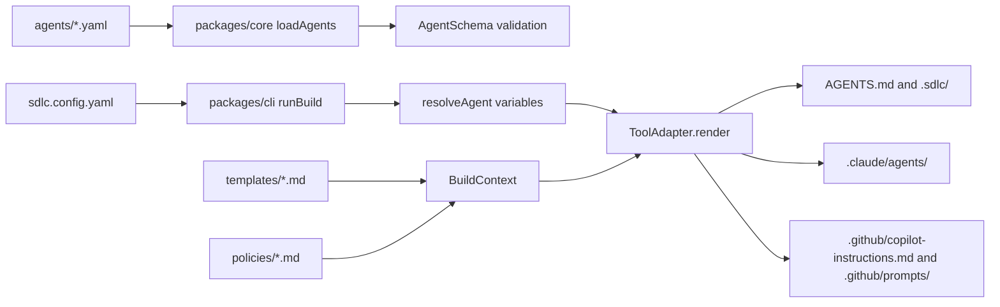
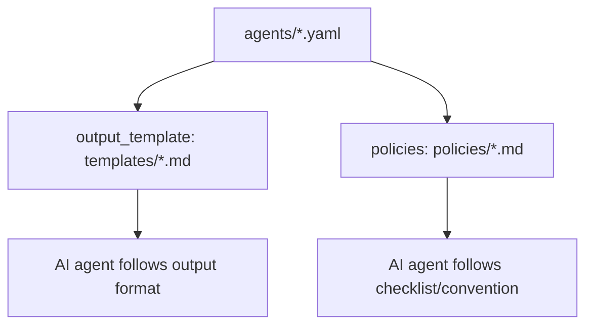

# Codebase Folder Guide - Agentic SDLC Agents Set

Tai lieu nay mo ta codebase hien tai cua `sdlc-agent` sau khi doi chieu voi `docs/SA_DESIGN_Agentic_SDLC_Agents_Set.md` va source code thuc te trong repo.

Muc tieu cua project la duy tri mot bo dinh nghia AI agent cho cac phase SDLC theo mo hinh "write once, render everywhere": agent duoc viet mot lan o dang canonical YAML, sau do build engine render ra cac format ma nhieu AI tools co the doc duoc nhu `AGENTS.md`, `.sdlc/agents/*.md`, `.claude/agents/*.md`, va `.github/prompts/*.prompt.md`.

## 1. Tong quan kien truc

Theo SA design, he thong co 3 lop chinh:

1. Canonical layer
   - Chua source of truth cua agent, template, policy va config.
   - Trong codebase hien tai, lop nay nam chu yeu o `agents/`, `templates/`, `policies/`, va `sdlc.config.yaml`.

2. Build engine
   - Doc config, load YAML agents, validate schema, resolve bien, roi render output.
   - Trong codebase hien tai, build engine duoc chia thanh `packages/core/` va `packages/cli/`.

3. Tool adapters
   - Chuyen agent canonical thanh format rieng cho tung AI tool.
   - Hien co 3 adapter: `universal`, `claude-code`, va `copilot` trong `packages/adapters/`.

Luong build thuc te:



## 2. Root folder va root files

### `package.json`

Root package cua monorepo `sdlc-agents`.

Chuc nang chinh:

- Khai bao project private, package manager `pnpm@9.15.0`.
- Chua script dev/build/test:
  - `pnpm sdlc`: chay CLI bang `tsx packages/cli/src/index.ts`.
  - `pnpm spike`: chay prototype renderer o `spike/render.ts`.
  - `pnpm typecheck`: chay `tsc --noEmit`.
  - `pnpm test`: chay `vitest run`.
  - `pnpm build`: chay build trong workspace packages.
  - `pnpm lint`: chay `biome check .`.
- Khai bao dependency runtime dang dung:
  - `yaml`: parse YAML agent/config.
  - `zod`: validate schema agent/config.
- Khai bao dev tooling:
  - TypeScript, Vitest, Vite, tsx, Biome.

### `pnpm-workspace.yaml`

Dinh nghia workspace packages:

- `packages/*`
- `packages/adapters/*`

Nho file nay, cac package nhu `@sdlc-agents/core`, `@sdlc-agents/cli`, `@sdlc-agents/adapter-universal` co the depend nhau bang `workspace:*`.

### `pnpm-lock.yaml`

Lockfile cua pnpm. Ghi lai dependency tree va link workspace packages.

Trong codebase nay lockfile dang co cac importer cho:

- Root project.
- `packages/core`.
- `packages/cli`.
- `packages/adapters/claude-code`.
- `packages/adapters/copilot`.
- `packages/adapters/universal`.

### `tsconfig.json`

TypeScript config dung chung cho repo.

Diem quan trong:

- `target: ES2022`.
- `module: ESNext`.
- `moduleResolution: bundler`.
- `strict: true`.
- Alias path:
  - `@sdlc-agents/core` -> `./packages/core/src/index.ts`.
- `include` hien tai gom:
  - `packages/*/src/**/*`
  - `spike/**/*`
- `exclude` bo qua:
  - `node_modules`
  - `dist`
  - `spike/output`

Luu y: pattern `packages/*/src/**/*` match `packages/core/src` va `packages/cli/src`, nhung voi adapters nam o `packages/adapters/<adapter>/src`, kha nang typecheck phu thuoc vao cach TypeScript resolve package imports va test files. Hien `pnpm typecheck` dang pass.

### `vitest.config.ts`

Config test runner.

Dang include:

```ts
test: {
  include: ["packages/*/src/**/*.test.ts"],
}
```

Luu y: pattern nay phu hop voi `packages/core/src/**/*.test.ts` va `packages/cli/src/**/*.test.ts`. Adapter tests nam sau mot cap sau hon (`packages/adapters/*/src/**/*.test.ts`). Thuc te `pnpm test` hien van pass voi 6 test files trong lan kiem tra gan nhat; neu muon dam bao adapter tests luon duoc include ro rang, nen can nhac them pattern `packages/adapters/*/src/**/*.test.ts`.

### `sdlc.config.yaml`

Config runtime cua build engine.

Chuc nang:

- Khai bao targets can render:
  - `universal`
  - `claude-code`
  - `copilot`
- Khai bao variables de inject vao agent text:
  - `language: en`
  - co comment mau cho `team`.

CLI `runBuild()` doc file nay bang `loadConfig(cwd)`. Neu file khong ton tai, `packages/core/src/config.ts` se dung default:

- targets: `["universal", "claude-code"]`
- variables: `{ language: "en" }`
- agentsDir: `"agents"`

### `AGENTS.md`

Output generated cua universal adapter.

Chuc nang:

- La entry point theo convention `AGENTS.md`.
- Liet ke cac agent co san va link den `.sdlc/agents/*.md`.
- Huong dan cach invoke agent tren Claude Code, Cursor, Windsurf, Codex, Gemini CLI va cac tool doc markdown khac.

File nay duoc tao lai khi chay `sdlc build`. Khong nen sua tay neu thay doi can duoc giu lau dai; sua source trong `agents/`, `templates/`, `policies/` hoac adapter renderer.

### `.gitignore`

Bo qua dependency/cache/build output:

- `node_modules/`
- `dist/`, `out/`, `build/`
- `.next/`, `.nuxt/`, `.turbo/`
- `spike/output/`
- log, coverage, env files, IDE files, OS files, cache files.

### `sdlc-phase1.bundle`

Git bundle artifact cua phase 1. Day la binary-ish artifact de luu/trao doi commit history hoac snapshot Git.

Khong phai source runtime cua build engine. Neu can doc noi dung, dung Git command nhu:

```bash
git bundle verify sdlc-phase1.bundle
git bundle list-heads sdlc-phase1.bundle
```

## 3. `agents/` - canonical agent definitions

`agents/` la source of truth quan trong nhat cua agent catalog. Moi file YAML la mot agent theo schema trong `packages/core/src/schema.ts`.

Hien co 6 agent MVP:

| File | Agent | Phase | Chuc nang |
|---|---|---|---|
| `agents/requirement-analyst.yaml` | `requirement-analyst` | `requirement` | Lam ro yeu cau mo ho, tao PRD, user stories, acceptance criteria va out-of-scope. |
| `agents/solution-architect.yaml` | `solution-architect` | `architecture` | Tao HLD/ADR, so sanh trade-off kien truc, ve diagram va liet ke open questions. |
| `agents/planner.yaml` | `planner` | `planning` | Bien PRD/spec thanh implementation plan, task, dependency, effort va risk. |
| `agents/coder.yaml` | `coder` | `coding` | Implement task theo TDD: red, green, refactor, run tests, commit. |
| `agents/test-generator.yaml` | `test-generator` | `testing` | Sinh test plan va test code tu spec/source, bao gom happy path va edge cases. |
| `agents/code-reviewer.yaml` | `code-reviewer` | `review` | Review PR diff theo checklist security, performance va convention. |

### Cau truc YAML agent

Moi agent gom cac field chinh:

- `id`: kebab-case, vi du `code-reviewer`.
- `version`: semver `x.y.z`.
- `phase`: mot trong cac phase hop le cua schema.
- `description`: mo ta agent; adapter dung lam trigger/hien thi.
- `model_hint`: `fast`, `balanced`, hoac `high-reasoning`.
- `model_variants`: prompt append/prepend rieng theo tool/model, hien schema ho tro `claude`, `copilot`, `gemini`, `codex`.
- `tools_required`: danh sach tool ky vong agent duoc dung.
- `inputs`: danh sach input ma agent can.
- `workflow`: cac buoc bat buoc agent phai lam.
- `output_template`: file template output trong `templates/`.
- `policies`: danh sach policy tham chieu trong `policies/`.
- `imports`, `prompt_prepend`, `extends`: da co schema support, nhung logic import/extends chua duoc implement day du trong build engine hien tai.

### Khi nao sua folder nay

Sua `agents/` khi muon:

- Them agent moi.
- Doi workflow cua agent.
- Doi phase, description, model hint, required tools.
- Gan policy/template cho agent.
- Them prompt variant cho Claude/Copilot/Gemini/Codex.

Sau khi sua, chay:

```bash
pnpm sdlc validate
pnpm sdlc build
pnpm test
```

## 4. `templates/` - output templates

`templates/` chua cac mau tai lieu ma agents se su dung khi sinh output.

Hien co:

- `templates/plan.md`: mau implementation plan cho `planner`.
- `templates/review-report.md`: mau review report cho `code-reviewer`.
- `templates/prd.md`: mau PRD cho `requirement-analyst`.
- `templates/hld.md`: mau HLD/ADR cho `solution-architect`.
- `templates/test-plan.md`: mau test plan cho `test-generator`.

### Trang thai implement hien tai

CLI `runBuild()` co load folder `templates/` vao `BuildContext.templates`, nhung cac adapter hien tai chi render dong tham chieu:

```md
Use template `templates/plan.md`.
```

Chua co logic expand template body vao generated agent files. Nghia la template hien la artifact huong dan cho AI agent, khong phai input duoc render/compile vao prompt body.

### Khi nao sua folder nay

Sua `templates/` khi muon thay doi dinh dang tai lieu dau ra:

- Format PRD.
- Format HLD/ADR.
- Format plan.
- Format review report.
- Format test plan.

## 5. `policies/` - checklist va coding policy

`policies/` chua guideline va checklist dung boi agent.

Hien co:

- `policies/conventions.md`
  - Naming conventions.
  - Function length guidance.
  - Error handling.
  - Testing expectations.
  - TypeScript rules.

- `policies/security-checklist.md`
  - Input validation.
  - Auth/authz.
  - Secrets.
  - Dependency review.
  - Logging/PII.

### Trang thai implement hien tai

Tuong tu templates, policies duoc load vao `BuildContext.policies`, nhung adapter hien tai chi render link/tham chieu den policy file. Noi dung policy chua duoc inline vao generated prompt.

Universal adapter render link dang:

```md
- [`conventions`](../../policies/conventions.md)
```

Claude adapter render:

```md
- `policies/conventions.md`
```

Copilot adapter hien chua render section policies trong prompt file, ngoai workflow/output. Neu Copilot prompt can policy explicit hon, adapter can duoc mo rong.

## 6. `packages/core/` - build engine core

`packages/core/` la library core, khong phu thuoc vao CLI UI. No cung cap schema, loader, config, resolver, merger va shared types.

### `packages/core/package.json`

Package manifest cho `@sdlc-agents/core`.

Chuc nang:

- Khai bao package private ESM.
- Export `./src/index.ts`.
- Depend vao `yaml` va `zod`.

### `packages/core/src/schema.ts`

Dinh nghia Zod schema cho canonical agent.

Thanh phan chinh:

- `ModelHint`: enum `fast`, `balanced`, `high-reasoning`.
- `WorkflowStep`: object co `step` va optional `ref`.
- `ImportEntry`: object cho import skill tu GitHub theo pattern `github:owner/repo`, co `path`, `pin`, va license hop le.
- `InputDef`: input cua agent, co `name`, optional `description`, `required` default `false`.
- `ModelVariant`: optional `prompt_append`, `prompt_prepend`.
- `AgentSchema`: schema tong.
- `AgentDef`: type infer tu `AgentSchema`.

Validation quan trong:

- `id` phai kebab-case.
- `version` phai semver `x.y.z`.
- `phase` phai thuoc danh sach phase duoc phep.
- `description` toi thieu 10 ky tu.
- `workflow` phai co it nhat 1 step.
- `imports.license` chi cho phep MIT, Apache-2.0, BSD-2-Clause, BSD-3-Clause.

### `packages/core/src/types.ts`

Chua shared interfaces cho build engine va adapters.

Interfaces:

- `OutputFile`
  - `path`: duong dan output relative voi consumer project root.
  - `content`: noi dung file.

- `Diagnostic`
  - `severity`: `error`, `warning`, `info`.
  - `message`: noi dung diagnostic.
  - `source`: optional source file.

- `ResolvedConfig`
  - `targets`: danh sach adapter targets.
  - `rootDir`: root absolute cua project.
  - `variables`: bien dung cho `{{...}}`.
  - `agentsDir`: folder agent definitions.

- `BuildContext`
  - `config`: resolved config.
  - `templates`: map template filename -> content.
  - `policies`: map policy name -> content.

- `ToolAdapter`
  - `name`: ten adapter.
  - `render(agents, ctx)`: tra ve danh sach output files.
  - `validate?(outputs)`: optional validation hook, chua adapter nao implement.

### `packages/core/src/config.ts`

Doc `sdlc.config.yaml`.

Flow:

1. Tao default config:
   - targets: `["universal", "claude-code"]`
   - rootDir: absolute path cua input dir.
   - variables: `{ language: "en" }`
   - agentsDir: `"agents"`
2. Kiem tra `sdlc.config.yaml`.
3. Neu khong co file, tra default.
4. Neu co file:
   - doc raw UTF-8.
   - parse YAML.
   - validate bang `ConfigFileSchema`.
   - merge parsed config len default.
   - merge rieng `variables` de giu default variables.

Schema config hien ho tro:

- `targets?: string[]`
- `variables?: Record<string, string>`
- `agentsDir?: string`

### `packages/core/src/loader.ts`

Load agent YAML tu folder.

Flow:

1. `readdirSync(dir)`.
2. Loc file `.yaml`.
3. Sort file de output deterministic.
4. Doc tung file UTF-8.
5. Parse YAML bang `yaml.parse`.
6. Validate bang `AgentSchema.parse`.
7. Tra ve `AgentDef[]`.

Neu YAML invalid, function throw ZodError hoac parse error.

### `packages/core/src/merger.ts`

Cung cap `mergeConfigs(base, ...overrides)`.

Chuc nang:

- Merge scalar fields theo thu tu: override sau thang override truoc.
- Deep-merge rieng `variables`.
- Khong mutate base config.

Hien codebase chua dung `mergeConfigs()` trong CLI flow, nhung no la nen mong cho customization multi-layer da neu trong SA design: base -> org -> team -> project -> local.

### `packages/core/src/resolver.ts`

Resolve bien trong agent.

Functions:

- `resolveVariables(text, vars)`
  - Thay `{{key}}` bang `vars[key]`.
  - Neu key khong ton tai, giu nguyen placeholder.
  - Regex hien tai chi match key word chars: `/\{\{(\w+)\}\}/g`.

- `resolveAgent(agent, vars)`
  - Serialize agent thanh JSON string.
  - Resolve variables tren string.
  - Parse lai JSON thanh `AgentDef`.

Diem can biet:

- Cach serialize/parse giup resolve bien trong moi field string cua object.
- Khong mutate original agent.
- Chi ho tro placeholder don gian `{{language}}`, `{{team}}`; khong ho tro expression nhu `{{stack | default: "not specified"}}` trong templates.

### `packages/core/src/index.ts`

Public barrel export cua core package.

Export:

- Functions: `loadConfig`, `loadAgents`, `mergeConfigs`, `resolveAgent`, `resolveVariables`.
- Schema/type: `AgentSchema`, `AgentDef`.
- Shared types: `BuildContext`, `Diagnostic`, `OutputFile`, `ResolvedConfig`, `ToolAdapter`.

### `packages/core/src/__tests__/`

Unit tests cho core.

- `schema.test.ts`
  - Agent valid pass.
  - Id uppercase fail.
  - Version khong semver fail.
  - Phase unknown fail.
  - Workflow empty fail.
  - Description ngan fail.
  - `model_hint` default `balanced`.
  - Import source/license validation.

- `loader.test.ts`
  - Load all `.yaml`.
  - Ignore non-YAML.
  - Throw khi invalid YAML theo schema.

- `merger.test.ts`
  - Scalar override.
  - Deep merge variables.
  - Preserve base.
  - Last wins.
  - Khong mutate base.

- `resolver.test.ts`
  - Replace known variables.
  - Leave unknown variables.
  - Multiple occurrences.
  - Resolve trong agent object.
  - Khong mutate original.

### `packages/core/src/__fixtures__/`

Fixture cho tests:

- `valid/`
  - `planner.yaml`
  - `code-reviewer.yaml`
  - `README.md` de test ignore non-YAML.
- `invalid/`
  - `bad.yaml` de test validation fail.

## 7. `packages/cli/` - command line interface

`packages/cli/` la CLI package `@sdlc-agents/cli`.

### `packages/cli/package.json`

Chuc nang:

- Package private ESM.
- Bin `sdlc` tro den `./src/index.ts`.
- Depend vao:
  - `@sdlc-agents/core`
  - `@sdlc-agents/adapter-universal`
  - `@sdlc-agents/adapter-claude-code`
  - `@sdlc-agents/adapter-copilot`
  - `commander`

### `packages/cli/src/index.ts`

CLI entrypoint.

Dung `commander` de define:

- `sdlc build`
  - Option `-C, --cwd <dir>`.
  - Goi `runBuild(opts.cwd)`.

- `sdlc validate`
  - Option `-C, --cwd <dir>`.
  - Goi `runValidate(path.join(opts.cwd, "agents"))`.
  - Neu false thi `process.exit(1)`.

- `sdlc init`
  - Option `-C, --cwd <dir>`.
  - Goi `runInit(opts.cwd)`.

Version CLI hien la `0.1.0`.

### `packages/cli/src/commands/build.ts`

Day la orchestration thuc te cua build engine.

Flow chi tiet:

1. `loadConfig(cwd)`.
2. Build `agentsDir = path.join(cwd, config.agentsDir)`.
3. `loadAgents(agentsDir)`.
4. Resolve variables cho tung agent bang `resolveAgent(a, config.variables)`.
5. Tao `BuildContext`:
   - `config`
   - `templates: loadDir(path.join(cwd, "templates"))`
   - `policies: loadDir(path.join(cwd, "policies"))`
6. Loop qua `config.targets`.
7. Lookup adapter trong map:
   - `universal`
   - `claude-code`
   - `copilot`
8. Neu target khong biet, warn va skip.
9. Goi `adapter.render(agents, ctx)`.
10. Ghi tung output file ra disk:
    - Tao folder recursive.
    - Ghi UTF-8.
11. Log so file tung adapter va tong so file.

Helper `loadDir(dir)`:

- Neu dir khong ton tai, tra `Map` rong.
- Chi load file truc tiep trong dir, khong recurse.

### `packages/cli/src/commands/validate.ts`

Validate all agent YAML.

Flow:

1. Goi `loadAgents(agentsDir)`.
2. Neu thanh cong, log so agents valid va return `true`.
3. Neu bat duoc `ZodError`, print tung issue theo path/message.
4. Neu loi khac, print `String(err)`.
5. Return `false`.

### `packages/cli/src/commands/init.ts`

Scaffold config mac dinh.

Flow:

1. Dat output la `<cwd>/sdlc.config.yaml`.
2. Neu file da ton tai, log skip.
3. Neu chua co, ghi `DEFAULT_CONFIG`.
4. Log next step: `sdlc build`.

Default config render 3 targets:

- `universal`
- `claude-code`
- `copilot`

### `packages/cli/src/__tests__/`

CLI tests:

- `build.test.ts`
  - Tao temp project.
  - Copy real `agents/`.
  - Ghi temp `sdlc.config.yaml`.
  - Kiem tra build tao `AGENTS.md`.
  - Kiem tra build tao `.claude/agents/*.md`.
  - Kiem tra build idempotent: chay lan 2 cho output giong lan 1.

- `validate.test.ts`
  - Kiem tra real `agents/` pass validation.

## 8. `packages/adapters/` - render targets

`packages/adapters/` gom cac package adapter, moi adapter implement interface `ToolAdapter`.

### `packages/adapters/universal/`

Adapter universal render format portable.

Output:

- `AGENTS.md`
- `.sdlc/agents/<agent-id>.md` cho moi agent.

`UniversalAdapter.render()` tra ve:

```ts
[
  { path: "AGENTS.md", content: this.renderIndex(agents) },
  ...agents.map((a) => ({
    path: `.sdlc/agents/${a.id}.md`,
    content: this.renderAgent(a),
  })),
]
```

`renderIndex()` tao:

- Title `# SDLC Agents`.
- Huong dan invoke.
- Bang agent: id, phase, description first line.
- Footer generated.

`renderAgent()` tao:

- Heading agent id.
- Phase, version, model.
- Description.
- Inputs.
- Workflow.
- Optional output template reference.
- Optional policies links.
- Universal footer.

Dung cho:

- Codex.
- Cursor.
- Windsurf.
- Gemini CLI.
- Bat ky AI tool nao doc duoc `AGENTS.md` va Markdown.

Tests:

- Kiem tra adapter name.
- Kiem tra output paths.
- Kiem tra `AGENTS.md` co id/phase.
- Kiem tra agent file co workflow.
- Snapshot test cho `AGENTS.md`.

### `packages/adapters/claude-code/`

Adapter native cho Claude Code subagents.

Output:

- `.claude/agents/<agent-id>.md` cho moi agent.

Dac diem render:

- YAML frontmatter:
  - `name`
  - `description`
  - `model`
  - `tools`
- Body Markdown gom:
  - title.
  - description.
  - Claude-specific prompt append neu co `agent.model_variants.claude.prompt_append`.
  - inputs.
  - workflow.
  - output template reference.
  - policy references.
  - generated footer.

Model map hien tai:

| `model_hint` | Claude model output |
|---|---|
| `fast` | `claude-haiku-4-5-20251001` |
| `balanced` | `claude-sonnet-4-6` |
| `high-reasoning` | `claude-opus-4-8` |

Tests:

- Kiem tra adapter name.
- Kiem tra moi agent render mot file.
- Kiem tra YAML frontmatter co name/model.
- Kiem tra workflow steps.
- Kiem tra Claude-specific note.
- Snapshot test.

### `packages/adapters/copilot/`

Adapter native cho GitHub Copilot.

Output:

- `.github/copilot-instructions.md`
- `.github/prompts/<agent-id>.prompt.md` cho moi agent.

`renderInstructions()` tao:

- Title `# SDLC Agents - Copilot Instructions`.
- Huong dan activate agent.
- Danh sach agent va link prompt file.

`renderPrompt()` tao prompt file:

- YAML frontmatter:
  - `mode: agent`
  - `description`
- Body:
  - agent title/phase.
  - description.
  - optional Copilot note tu `model_variants.copilot.prompt_append`.
  - inputs.
  - workflow.
  - optional output template reference.
  - generated footer.

Luu y: Copilot adapter hien khong render policies section, nen policy chi duoc the hien neu workflow step tu agent co noi den policy.

Tests:

- Kiem tra adapter name.
- Kiem tra output instructions va prompt files.
- Kiem tra instructions list all agents.
- Kiem tra prompt co workflow.
- Snapshot test.

## 9. Generated output folders

Generated outputs la nhung file duoc tao ra tu `agents/` thong qua adapters. Chinh sach chung: khong sua tay neu muon thay doi lau dai; sua canonical source hoac adapter, roi chay `pnpm sdlc build`.

### `.sdlc/`

Universal generated folder.

Hien co:

- `.sdlc/agents/code-reviewer.md`
- `.sdlc/agents/coder.md`
- `.sdlc/agents/planner.md`
- `.sdlc/agents/requirement-analyst.md`
- `.sdlc/agents/solution-architect.md`
- `.sdlc/agents/test-generator.md`

Moi file la Markdown portable:

- Phase/version/model.
- Agent description.
- Inputs.
- Workflow.
- Output template reference.
- Policy reference neu co.

Folder nay la companion cua root `AGENTS.md`.

### `.claude/`

Claude Code generated folder.

Hien co:

- `.claude/agents/*.md` cho 6 agents.

Moi file co YAML frontmatter phu hop voi Claude Code subagent:

- `name`
- `description`
- `model`
- `tools`

Body gom workflow chi tiet va note rieng cho Claude neu agent co `model_variants.claude`.

### `.github/`

GitHub-related folder.

Generated Copilot outputs:

- `.github/copilot-instructions.md`
- `.github/prompts/*.prompt.md`

CI workflow:

- `.github/workflows/ci.yml`

Luu y quan trong ve CI:

- Workflow hien cau hinh `paths` va `working-directory` theo `AI_Agent_SDLC_set/**`.
- Source code thuc te cua repo hien dang nam o root (`packages/`, `agents/`, `templates/`, ...), khong phai trong nested folder `AI_Agent_SDLC_set/`.
- Neu CI duoc ky vong chay cho root project hien tai, workflow can duoc review/cap nhat. Tai lieu nay chi ghi nhan, khong sua workflow.

## 10. `docs/` - design va planning docs

### `docs/SA_DESIGN_Agentic_SDLC_Agents_Set.md`

Tai lieu solution architecture goc.

No dinh nghia:

- Product vision: library agent definitions da nen tang.
- Problem statement: moi team/tool viet prompt rieng gay trung lap va chat luong khong dong deu.
- Goals/non-goals.
- Personas va use cases.
- Agent catalog theo SDLC phase.
- Kien truc:
  - canonical layer.
  - build engine.
  - universal adapter.
  - native adapters.
  - config/customization layer.
  - distribution.
- DSL agent YAML mau.
- Roadmap phase 0/1/2/3.
- Risks/mitigations.
- Chien luoc reuse skill ecosystem.

### `docs/superpowers/plans/2026-06-10-phase1-build-engine.md`

Implementation plan cho phase 1 build engine.

Dung de truy vet:

- Ly do chia core/CLI/adapters.
- Scope cong viec phase 1.
- Cac task va acceptance criteria.

### `docs/CODEBASE_FOLDER_GUIDE.md`

Chinh la file hien tai. Muc dich la bridge giua SA design va code thuc te.

## 11. `spike/` - prototype phase 0

`spike/render.ts` la prototype doc-lap cua build engine phase 0.

Chuc nang:

- Dinh nghia inline `AgentSchema` rieng cho spike.
- Load `agents/*.yaml`.
- Validate bang Zod.
- Render:
  - Claude Code output vao `spike/output/claude-code/.claude/agents/*.md`.
  - Universal output vao `spike/output/universal/AGENTS.md` va `.sdlc/agents/*.md`.

Khac voi implementation moi:

- Schema nam inline trong file spike, khong dung `@sdlc-agents/core`.
- Chi render Claude Code va Universal, chua co Copilot.
- Output folder `spike/output/` bi `.gitignore`.

Vai tro:

- Luu lai bang chung/thiet ke ban dau.
- Co the dung de so sanh y tuong, nhung code production nen nam o `packages/core`, `packages/cli`, `packages/adapters`.

## 12. `examples/` - placeholder

`examples/` hien la folder rong.

Theo SA design, folder nay du kien chua demo project da build san cho tung tool/adapters.

Tuong lai co the chua:

- Example repo dung universal output.
- Example repo dung Claude Code subagents.
- Example repo dung Copilot prompts.
- Golden sample cho docs/tutorial.

## 13. `skills/` - placeholder

`skills/` hien la folder rong.

Theo SA design, folder nay du kien chua workflow/skills chi tiet, co the duoc agent import hoac tham chieu.

Hien schema da co field `imports`, `prompt_prepend`, `extends`, nhung build engine chua implement:

- Vendor external skills.
- Pin import by commit/tag.
- License check runtime.
- Inline/wrap imported skill content.

Neu phase sau implement import/community skill reuse, folder nay se la noi chua skill local hoac vendored skill.

## 14. `policies/`, `templates/`, `agents/` quan he voi nhau nhu the nao

Ba folder nay la canonical content layer:



Trong code hien tai:

- `agents/*.yaml` bat buoc qua schema validation.
- `templates/*.md` va `policies/*.md` duoc load vao build context nhung chua validate cross-reference.
- Neu agent tro den template/policy khong ton tai, build van co the thanh cong vi adapter chi render string/link.

Rui ro hien tai:

- Co the co dangling template/policy reference ma test khong bat.
- Copilot output chua render policy section ro rang.
- Template syntax nhu `{{#each tasks}}` khong duoc engine parse; no chi la huong dan cho AI hoac placeholder cho tuong lai.

## 15. Test strategy hien tai

Test hien tai tap trung vao:

- Schema correctness.
- YAML loading.
- Config merge.
- Variable resolution.
- CLI build/validate.
- Adapter rendering contract va snapshots.

Lenh validation da chay gan nhat:

```bash
pnpm test
pnpm typecheck
```

Ket qua gan nhat:

- `pnpm test`: 6 test files pass, 29 tests pass.
- `pnpm typecheck`: pass.

## 16. Cach them mot agent moi

Quy trinh khuyen nghi:

1. Tao file `agents/<new-agent-id>.yaml`.
2. Dam bao `id` kebab-case va `version` semver.
3. Chon `phase` trong enum schema.
4. Viet `description` ro va co ich cho routing.
5. Them `inputs`, `workflow`, `tools_required`.
6. Neu co output format, tao/sua file trong `templates/`.
7. Neu can checklist, tao/sua file trong `policies/`.
8. Chay validate:

```bash
pnpm sdlc validate
```

9. Render output:

```bash
pnpm sdlc build
```

10. Chay test/typecheck:

```bash
pnpm test
pnpm typecheck
```

## 17. Cach them adapter moi

Theo pattern hien tai:

1. Tao package moi trong `packages/adapters/<tool-name>/`.
2. Tao `package.json` depend vao `@sdlc-agents/core`.
3. Implement class `<ToolName>Adapter implements ToolAdapter`.
4. Method `render(agents, ctx)` tra ve `OutputFile[]`.
5. Them tests va snapshot neu output co format on dinh.
6. Them package vao dependency cua `packages/cli/package.json`.
7. Import adapter trong `packages/cli/src/commands/build.ts`.
8. Them vao `ADAPTERS` map:

```ts
const ADAPTERS: Record<string, ToolAdapter> = {
  universal: new UniversalAdapter(),
  "claude-code": new ClaudeCodeAdapter(),
  copilot: new CopilotAdapter(),
  "<tool-name>": new ToolNameAdapter(),
};
```

9. Them target vao `sdlc.config.yaml`.
10. Chay `pnpm install`, `pnpm test`, `pnpm typecheck`, `pnpm sdlc build`.

## 18. Cac diem can chu y khi tiep tuc phat trien

### 18.1 CodeGraph

Repo hien chua initialize CodeGraph. Khi can tra loi cau hoi structural lon hon, co the chay:

```bash
codegraph init -i
```

Sau do dung `codegraph_context`, `codegraph_explore`, `codegraph_files` de doc kien truc nhanh hon.

### 18.2 Encoding output hien thi

Mot so terminal output tren Windows co the hien thi mojibake voi ky tu Unicode/Vietnamese/emoji. File source van co the la UTF-8; neu can kiem tra noi dung chinh xac, doc bang editor hoac lenh co encoding UTF-8.

### 18.3 Template engine chua co

Templates hien dung cu phap placeholder/handlebars-like, nhung code chua co engine render template. Dung chung voi AI prompt thi duoc, nhung neu ky vong build engine generate document final tu data structured thi can implement template renderer rieng.

### 18.4 Config multi-layer chua duoc wire vao CLI

SA design noi den merge config 5 lop. Code hien co `mergeConfigs()`, nhung `runBuild()` chi doc mot file `sdlc.config.yaml`. Phase sau can wire cac lop config neu muon dat dung design.

### 18.5 `imports` va `extends` moi o schema

Schema da chap nhan `imports` va `extends`, nhung loader/resolver/build chua implement semantic cho:

- Ke thua agent.
- Vendor skill.
- License enforcement runtime.
- Diff/bump imported skill.

### 18.6 CI workflow can review

`.github/workflows/ci.yml` dang cau hinh cho nested folder `AI_Agent_SDLC_set`. Neu repo root hien tai la project chinh, CI co the khong chay dung pham vi. Nen cap nhat workflow khi muc tieu la CI cho source root.

## 19. Tom tat nhanh theo folder

| Folder/File | Loai | Sua tay? | Chuc nang |
|---|---|---:|---|
| `agents/` | Canonical source | Co | Dinh nghia 6 SDLC agents bang YAML. |
| `templates/` | Canonical source | Co | Mau output PRD/HLD/plan/review/test-plan. |
| `policies/` | Canonical source | Co | Checklist convention va security. |
| `packages/core/` | Code runtime | Co | Schema, config, loader, merge, resolver, shared types. |
| `packages/cli/` | Code runtime | Co | CLI `sdlc init/build/validate`. |
| `packages/adapters/` | Code runtime | Co | Render agent sang universal, Claude Code, Copilot. |
| `.sdlc/` | Generated output | Khong nen | Universal per-agent markdown. |
| `.claude/` | Generated output | Khong nen | Claude Code subagents. |
| `.github/prompts/` | Generated output | Khong nen | Copilot prompt files. |
| `.github/copilot-instructions.md` | Generated output | Khong nen | Copilot repo instructions. |
| `.github/workflows/` | CI config | Co | GitHub Actions workflow, hien can review path. |
| `docs/` | Documentation | Co | SA design, implementation plan, codebase guide. |
| `spike/` | Prototype | Co, nhung can can nhac | Phase 0 renderer prototype. |
| `examples/` | Placeholder | Co | Du kien chua demo projects. |
| `skills/` | Placeholder | Co | Du kien chua local/vendored skills. |
| `node_modules/` | Dependency install | Khong | Generated by package manager. |
| `sdlc-phase1.bundle` | Git artifact | It khi | Bundle artifact, khong phai runtime source. |

## 20. Mental model ngan gon

Neu can hieu project nhanh:

1. `agents/*.yaml` la noi dinh nghia agent.
2. `packages/core` dam bao agent hop le va resolve du lieu.
3. `packages/cli` dieu phoi build.
4. `packages/adapters/*` quyet dinh output file cho tung AI tool.
5. `.sdlc/`, `.claude/`, `.github/prompts/`, `AGENTS.md` la ket qua generated.
6. `templates/` va `policies/` la tai lieu tham chieu de agent tao output dung format va dung rule.

## 21. Danh gia bo sung sau khi review SA design va codebase

Phan nay duoc append de giu nguyen noi dung tai lieu goc phia tren. No tong hop cac danh gia va de xuat bo sung dua tren `docs/SA_DESIGN_Agentic_SDLC_Agents_Set.md` va code hien tai.

### 21.1 Diem manh cua du an

- Huong san pham dung pain point thuc te: cac team dang copy prompt/agent config theo tung tool, kho version, kho test va kho chuan hoa.
- Kien truc canonical DSL -> build engine -> adapters la dung huong. `agents/*.yaml` dong vai tro source of truth, adapter chi lo dong goi sang tung tool.
- Universal-first la quyet dinh tot. `AGENTS.md` va `.sdlc/agents/*.md` tao baseline portable cho Codex, Cursor, Windsurf, Gemini CLI va cac AI tool co the doc file repo.
- Adapter pattern hien tai gon va de mo rong: moi adapter chi can implement `ToolAdapter.render()`.
- Code da co nen test tot cho giai doan MVP: schema tests, loader tests, resolver tests, CLI build tests va adapter snapshot tests.
- SA design da nhin dung cac rui ro dai han nhu prompt supply-chain, versioning, eval harness, policy layer va adapter compatibility.

### 21.2 Diem yeu va rui ro can quan ly

- Scope trong SA design dang kha rong. Registry, update mechanism, telemetry, eval harness, marketplace, imported community skills va multi-layer config deu co gia tri, nhung neu dua vao MVP qua som thi de lam loang delivery.
- Code hien tai moi implement phan xong song cua design. Mot so field/ham nhu `imports`, `extends`, `mergeConfigs`, `BuildContext.templates`, `BuildContext.policies` da ton tai nhung chua duoc wire het vao behavior cuoi.
- Template va policy hien chu yeu la reference cho AI agent. Build engine chua validate day du cross-reference va chua inline/render template body.
- Can can than voi claim "support moi AI tool". Cach noi chinh xac hon la: universal output tao portable baseline cho moi tool co the doc repo instructions; native UX/auto-routing van can adapter rieng va compatibility test.
- Generated outputs duoc commit vao repo la cach dung thuc te, nhung can co drift detection de biet file generated da bi sua tay hay chua duoc regenerate.

### 21.3 Bo sung nen dua vao SA design

1. Adapter contract
   - Moi adapter nen document output paths, required metadata, generated footer, snapshot test va compatibility notes.
   - Adapter moi phai co tests cho path contract va content contract co ban.

2. Reference validation
   - Build/validate nen fail neu `output_template` tro toi file khong ton tai.
   - Build/validate nen fail neu `policies` tro toi policy khong ton tai.
   - Build/validate nen fail neu co duplicate agent id.

3. Generated output strategy
   - Can quy dinh file nao la generated, co duoc sua tay khong, va build xu ly drift nhu the nao.
   - Nen them generated marker/footer on dinh de sau nay co the detect drift.

4. MVP exit criteria cu the hon
   - `validate` bat schema errors, duplicate ids va missing template/policy refs.
   - `build` deterministic.
   - 3 adapters hien co co snapshot/contract tests.
   - CI chay dung root project.
   - README co quickstart ro: install -> validate -> build -> use agent.

5. Eval nen tach sang phase sau
   - Phase 1 nen tap trung static tests, schema validation va snapshots.
   - Phase 2 moi them promptfoo/golden cases/model eval de tranh tang complexity som.

6. Prompt supply-chain security
   - Imported skills nen mac dinh disabled cho den khi co review.
   - Can lockfile/manifest luu source, license, pin va hash.
   - Khong nen auto-update skill tu branch/tag mutable.

### 21.4 Uu tien ky thuat de xuat

Thu tu uu tien nen lam:

1. Sua CI workflow de chay tren root project hien tai.
2. Dam bao Vitest include ro ca adapter tests.
3. Them validation cho duplicate agent id va missing template/policy references.
4. Them generated marker/drift detection co ban.
5. Hoan thien README quickstart.
6. Chuan hoa adapter contract trong docs.
7. Sau do moi implement multi-layer config, imports, extends va eval harness.

### 21.5 Ket luan danh gia

Du an dang co nen tang tot va dang giai quyet dung van de: bien prompt/agent workflow thanh artifact co schema, version, build va test. Gia tri lon nhat khong nam o tung prompt rieng le, ma nam o viec chuan hoa cach team dong goi va phan phoi SDLC agents tren nhieu AI tools.

Huong tiep theo nen giu MVP that gon: canonical agents, deterministic build, 3 adapters, validation chat va CI dung. Khi nen nay chac, cac phan lon hon nhu registry, import community skills, eval harness va update mechanism se de them hon nhieu.
