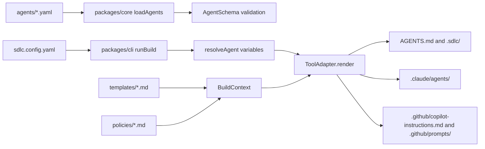
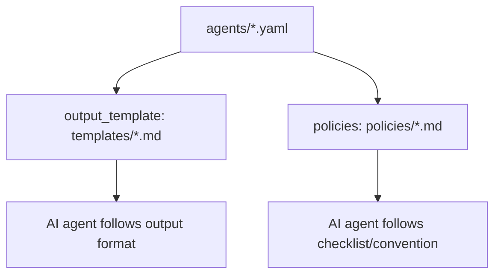

# Codebase Folder Guide - Agentic SDLC Agents Set

Tài liệu này mô tả codebase hiện tại của `sdlc-agent` sau khi đối chiếu với `docs/sa-design/SA_DESIGN_Agentic_SDLC_Agents_Set.md` và source code thực tế trong repo.

Mục tiêu của project là duy trì một bộ định nghĩa AI agent cho các phase SDLC theo hướng **Hybrid**: agent được viết một lần ở dạng canonical YAML, build engine render ra các format mà nhiều AI tools có thể đọc được như `AGENTS.md`, `.sdlc/agents/*.md`, `.claude/agents/*.md`, và `.github/prompts/*.prompt.md`; người dùng cuối thì đi qua installer/wizard ngắn như `npx sdlc-agents init`.

## 0. Dự án này làm gì và dùng như thế nào

`sdlc-agent` là một monorepo TypeScript để định nghĩa, validate, build và phân phối một bộ AI agents cho các giai đoạn SDLC: requirement, planning, architecture, coding, review và testing. Thay vì copy/paste prompt riêng cho từng tool, project giữ một nguồn chuẩn trong `agents/*.yaml`, sau đó render ra format phù hợp cho nhiều AI tools.

Định hướng sản phẩm hiện tại là **Hybrid**:

- **Builder core:** schema, validation, adapter render, drift detection và test suite vẫn là nền kỹ thuật chính.
- **Installer UX:** user cuối không cần nhớ chuỗi lệnh dài; `npx sdlc-agents init` sẽ hỏi đang dùng AI host nào, muốn bật agents nào, scope project hay user, language/team variables, rồi tự tạo config và chạy build lần đầu.

Mục đích sản phẩm theo SA design:

- Chuẩn hóa workflow AI agent cho team phát triển phần mềm.
- Giữ agent definition, template và policy ở dạng có version, có schema, có test.
- Build một lần ra nhiều target: Universal (`AGENTS.md`, `.sdlc/agents/`), Claude Code (`.claude/agents/`) và GitHub Copilot (`.github/prompts/`, `.github/copilot-instructions.md`).
- Cho phép team customize dần bằng config, policy, template và adapter, nhưng vẫn tránh sửa tay output generated.

Trạng thái hiện tại: Phase 1 MVP đã có 6 agents, CLI `init` / `validate` / `build`, 3 adapters, validation contract, drift detection và test coverage cơ bản. Các phần lớn hơn như multi-layer config, `imports`, `extends`, registry/update flow, eval harness và adapter plugin interface vẫn thuộc Phase 2+.

Cách dùng nhanh cho consumer project:

```bash
npx sdlc-agents init
```

Wizard sẽ hỏi AI host, agent preset, install scope và variables, rồi tạo `sdlc.config.yaml` và render output lần đầu. Với repo này, các lệnh `pnpm sdlc validate`, `pnpm sdlc build`, `pnpm test`, `pnpm typecheck`, `pnpm lint` là workflow maintainer/developer, không phải flow cài đặt cho user cuối.

## 0.1 Overview nhanh theo folder

| Folder/File | Sửa tay? | Generated sau lệnh? | Ý nghĩa nhanh |
|---|---:|---:|---|
| `agents/` | Có | Không | Source of truth của agent catalog. Sửa khi thêm agent, đổi workflow, input, model hint, policy/template reference. |
| `templates/` | Có | Không | Mẫu output mà agent phải dùng, ví dụ PRD, HLD, plan, review report, test plan. |
| `policies/` | Có | Không | Checklist/convention dùng bởi agents, ví dụ coding convention và security checklist. |
| `sdlc.config.yaml` | Có | Không | Config target render (`universal`, `claude-code`, `copilot`) và variables như `language`. |
| `packages/core/` | Có | Không | Schema, config loader, YAML loader, variable resolver, config merger, shared adapter types. |
| `packages/cli/` | Có | Không | CLI `sdlc init`, `sdlc validate`, `sdlc build`; Phase 2 sẽ mở rộng `init` thành interactive installer/wizard, host detection, agent preset và first build. |
| `packages/adapters/` | Có | Không | Renderer cho từng AI tool. Sửa ở đây khi output format của Claude/Copilot/Universal thay đổi. |
| `docs/**/*.md` | Có | Không | Source of truth của docs. Khi đổi nội dung docs, sửa Markdown trước. |
| `docs/**/*.html` | Có, nhưng phải mirror MD | Không | Rendered docs view. Cần cập nhật cùng nội dung với Markdown để không drift. |
| `AGENTS.md` | Không | Có, bởi `pnpm sdlc build` | Universal index cho AI tools đọc repo instructions. |
| `.sdlc/agents/*.md` | Không | Có, bởi `pnpm sdlc build` | Universal per-agent Markdown. |
| `.sdlc/build-manifest.json` | Không | Có, bởi `pnpm sdlc build` | Hash manifest để phát hiện generated file bị sửa tay. |
| `.claude/agents/*.md` | Không | Có, bởi `pnpm sdlc build` | Claude Code subagent files. |
| `.github/copilot-instructions.md` | Không | Có, bởi `pnpm sdlc build` | Copilot repository instructions. |
| `.github/prompts/*.prompt.md` | Không | Có, bởi `pnpm sdlc build` | Copilot prompt files cho từng agent. |
| `.github/workflows/` | Có | Không | CI: install, lint, typecheck, test, spike. |
| `spike/` | Ít khi | Không | Prototype Phase 0, giữ làm reference. Không phải runtime chính. |
| `node_modules/` | Không | Có, bởi `pnpm install` | Dependency install output. Không commit/sửa tay. |
| `pnpm-lock.yaml` | Không sửa tay | Có, bởi `pnpm install` | Lockfile dependency. Chỉ thay đổi qua package manager. |
| `sdlc-phase1.bundle` | Ít khi | Không | Git bundle artifact của phase 1, không phải source runtime. |

## 1. Tổng quan kiến trúc

Theo SA design, hệ thống có 4 lớp chính:

1. Canonical layer
   - Chứa source of truth của agent, template, policy và config.
   - Trong codebase hiện tại, lớp này nằm chủ yếu ở `agents/`, `templates/`, `policies/`, và `sdlc.config.yaml`.

2. Build engine
   - Đọc config, load YAML agents, validate schema, resolve biến, rồi render output.
   - Trong codebase hiện tại, build engine được chia thành `packages/core/` và `packages/cli/`.

3. Installer / Wizard UX
   - Hỏi hoặc detect AI host, agent preset, install scope và variables.
   - Tạo config và gọi build engine để user cuối có trải nghiệm cài đặt 1 lệnh.
   - Đây là hướng Hybrid tương tự trải nghiệm `npx skills` / `create-vue`, nhưng vẫn giữ canonical YAML/build engine làm source of truth.

4. Tool adapters
   - Chuyển agent canonical thành format riêng cho từng AI tool.
   - Hiện có 3 adapter: `universal`, `claude-code`, và `copilot` trong `packages/adapters/`.

Luồng build thực tế:



## 2. Root folder và root files

### `package.json`

Root package của monorepo `sdlc-agents`.

Chức năng chính:

- Khai báo project private, package manager `pnpm@9.15.0`.
- Chứa script dev/build/test:
  - `pnpm sdlc`: chạy CLI bằng `tsx packages/cli/src/index.ts`.
  - `pnpm spike`: chạy prototype renderer ở `spike/render.ts`.
  - `pnpm typecheck`: chạy `tsc --noEmit`.
  - `pnpm test`: chạy `vitest run`.
  - `pnpm build`: chạy `pnpm typecheck` để tránh build script no-op.
  - `pnpm lint`: chạy `biome check .`.
- Khai báo dependency runtime đang dùng:
  - `yaml`: parse YAML agent/config.
  - `zod`: validate schema agent/config.
- Khai báo dev tooling:
  - TypeScript, Vitest, Vite, tsx, Biome.

### `pnpm-workspace.yaml`

Định nghĩa workspace packages:

- `packages/*`
- `packages/adapters/*`

Nhờ file này, các package như `@sdlc-agents/core`, `@sdlc-agents/cli`, `@sdlc-agents/adapter-universal` có thể depend nhau bằng `workspace:*`.

### `pnpm-lock.yaml`

Lockfile của pnpm. Ghi lại dependency tree và link workspace packages.

Trong codebase này lockfile đang có các importer cho:

- Root project.
- `packages/core`.
- `packages/cli`.
- `packages/adapters/claude-code`.
- `packages/adapters/copilot`.
- `packages/adapters/universal`.

### `tsconfig.json`

TypeScript config dùng chung cho repo.

Điểm quan trọng:

- `target: ES2022`.
- `module: ESNext`.
- `moduleResolution: bundler`.
- `strict: true`.
- Alias path:
  - `@sdlc-agents/core` -> `./packages/core/src/index.ts`.
- `include` hiện tại gồm:
  - `packages/*/src/**/*`
  - `spike/**/*`
- `exclude` bỏ qua:
  - `node_modules`
  - `dist`
  - `spike/output`

Lưu ý: pattern `packages/*/src/**/*` match `packages/core/src` và `packages/cli/src`, nhưng với adapters nằm ở `packages/adapters/<adapter>/src`, khả năng typecheck phụ thuộc vào cách TypeScript resolve package imports và test files. Hiện `pnpm typecheck` đang pass.

### `vitest.config.ts`

Config test runner.

Đang include:

```ts
test: {
  include: [
    "packages/*/src/**/*.test.ts",
    "packages/adapters/*/src/**/*.test.ts",
  ],
}
```

Pattern riêng cho `packages/adapters/*/src/**/*.test.ts` đảm bảo adapter tests luôn được chạy cùng core và CLI tests. Lần kiểm tra hiện tại chạy 9 test files / 60 tests.

### `sdlc.config.yaml`

Config runtime của build engine.

Chức năng:

- Khai báo targets cần render:
  - `universal`
  - `claude-code`
  - `copilot`
- Khai báo variables để inject vào agent text:
  - `language: en`
  - có comment mẫu cho `team`.

CLI `runBuild()` đọc file này bằng `loadConfig(cwd)`. Nếu file không tồn tại, `packages/core/src/config.ts` sẽ dùng default:

- targets: `["universal", "claude-code"]`
- variables: `{ language: "en" }`
- agentsDir: `"agents"`

### `AGENTS.md`

Output generated của universal adapter.

Chức năng:

- Là entry point theo convention `AGENTS.md`.
- Liệt kê các agent có sẵn và link đến `.sdlc/agents/*.md`.
- Hướng dẫn cách invoke agent trên Claude Code, Cursor, Windsurf, Codex, Gemini CLI và các tool đọc markdown khác.

File này được tạo lại khi chạy `sdlc build`. Không nên sửa tay nếu thay đổi cần được giữ lâu dài; sửa source trong `agents/`, `templates/`, `policies/` hoặc adapter renderer.

### `.gitignore`

Bỏ qua dependency/cache/build output:

- `node_modules/`
- `dist/`, `out/`, `build/`
- `.next/`, `.nuxt/`, `.turbo/`
- `spike/output/`
- log, coverage, env files, IDE files, OS files, cache files.

### `sdlc-phase1.bundle`

Git bundle artifact của phase 1. Đây là binary-ish artifact để lưu/trao đổi commit history hoặc snapshot Git.

Không phải source runtime của build engine. Nếu cần đọc nội dung, dùng Git command như:

```bash
git bundle verify sdlc-phase1.bundle
git bundle list-heads sdlc-phase1.bundle
```

## 3. `agents/` - canonical agent definitions

`agents/` là source of truth quan trọng nhất của agent catalog. Mỗi file YAML là một agent theo schema trong `packages/core/src/schema.ts`.

Hiện có 6 agent MVP:

| File | Agent | Phase | Chức năng |
|---|---|---|---|
| `agents/requirement-analyst.yaml` | `requirement-analyst` | `requirement` | Làm rõ yêu cầu mơ hồ, tạo PRD, user stories, acceptance criteria và out-of-scope. |
| `agents/solution-architect.yaml` | `solution-architect` | `architecture` | Tạo HLD/ADR, so sánh trade-off kiến trúc, vẽ diagram và liệt kê open questions. |
| `agents/planner.yaml` | `planner` | `planning` | Biến PRD/spec thành implementation plan, task, dependency, effort và risk. |
| `agents/coder.yaml` | `coder` | `coding` | Implement task theo TDD: red, green, refactor, run tests, commit. |
| `agents/test-generator.yaml` | `test-generator` | `testing` | Sinh test plan và test code từ spec/source, bao gồm happy path và edge cases. |
| `agents/code-reviewer.yaml` | `code-reviewer` | `review` | Review PR diff theo checklist security, performance và convention. |

### Cấu trúc YAML agent

Mỗi agent gồm các field chính:

- `id`: kebab-case, ví dụ `code-reviewer`.
- `version`: semver `x.y.z`.
- `phase`: một trong các phase hợp lệ của schema.
- `description`: mô tả agent; adapter dùng làm trigger/hiển thị.
- `model_hint`: `fast`, `balanced`, hoặc `high-reasoning`.
- `model_variants`: prompt append/prepend riêng theo tool/model, hiện schema hỗ trợ `claude`, `copilot`, `gemini`, `codex`.
- `tools_required`: danh sách tool kỳ vọng agent được dùng.
- `inputs`: danh sách input mà agent cần.
- `workflow`: các bước bắt buộc agent phải làm.
- `output_template`: file template output trong `templates/`.
- `policies`: danh sách policy tham chiếu trong `policies/`.
- `imports`, `prompt_prepend`, `extends`: đã có schema support, nhưng logic import/extends chưa được implement đầy đủ trong build engine hiện tại.

### Khi nào sửa folder này

Sửa `agents/` khi muốn:

- Thêm agent mới.
- Đổi workflow của agent.
- Đổi phase, description, model hint, required tools.
- Gán policy/template cho agent.
- Thêm prompt variant cho Claude/Copilot/Gemini/Codex.

Sau khi sửa, chạy:

```bash
pnpm sdlc validate
pnpm sdlc build
pnpm test
```

## 4. `templates/` - output templates

`templates/` chứa các mẫu tài liệu mà agents sẽ sử dụng khi sinh output.

Hiện có:

- `templates/plan.md`: mẫu implementation plan cho `planner`.
- `templates/review-report.md`: mẫu review report cho `code-reviewer`.
- `templates/prd.md`: mẫu PRD cho `requirement-analyst`.
- `templates/hld.md`: mẫu HLD/ADR cho `solution-architect`.
- `templates/test-plan.md`: mẫu test plan cho `test-generator`.

### Trạng thái implement hiện tại

CLI `runBuild()` có load folder `templates/` vào `BuildContext.templates`, nhưng các adapter hiện tại chỉ render dòng tham chiếu:

```md
Use template `templates/plan.md`.
```

Chưa có logic expand template body vào generated agent files. Nghĩa là template hiện là artifact hướng dẫn cho AI agent, không phải input được render/compile vào prompt body.

### Khi nào sửa folder này

Sửa `templates/` khi muốn thay đổi định dạng tài liệu đầu ra:

- Format PRD.
- Format HLD/ADR.
- Format plan.
- Format review report.
- Format test plan.

## 5. `policies/` - checklist và coding policy

`policies/` chứa guideline và checklist dùng bởi agent.

Hiện có:

- `policies/conventions.md`
  - Naming conventions.
  - Function length guidance.
  - Error handling.
  - Testing expectations.
  - TypeScript rules.

- `policies/security-checklist.md`
  - Input validation.
  - Auth/authz.
  - Secrets.
  - Dependency review.
  - Logging/PII.

### Trạng thái implement hiện tại

Tương tự templates, policies được load vào `BuildContext.policies`, nhưng adapter hiện tại chỉ render link/tham chiếu đến policy file. Nội dung policy chưa được inline vào generated prompt.

Universal adapter render link dạng:

```md
- [`conventions`](../../policies/conventions.md)
```

Claude adapter render:

```md
- `policies/conventions.md`
```

Copilot adapter hiện chưa render section policies trong prompt file, ngoài workflow/output. Nếu Copilot prompt cần policy explicit hơn, adapter cần được mở rộng.

## 6. `packages/core/` - build engine core

`packages/core/` là library core, không phụ thuộc vào CLI UI. Nó cung cấp schema, loader, config, resolver, merger và shared types.

### `packages/core/package.json`

Package manifest cho `@sdlc-agents/core`.

Chức năng:

- Khai báo package private ESM.
- Export `./src/index.ts`.
- Depend vào `yaml` và `zod`.

### `packages/core/src/schema.ts`

Định nghĩa Zod schema cho canonical agent.

Thành phần chính:

- `ModelHint`: enum `fast`, `balanced`, `high-reasoning`.
- `WorkflowStep`: object có `step` và optional `ref`.
- `ImportEntry`: object cho import skill từ GitHub theo pattern `github:owner/repo`, có `path`, `pin`, và license hợp lệ.
- `InputDef`: input của agent, có `name`, optional `description`, `required` default `false`.
- `ModelVariant`: optional `prompt_append`, `prompt_prepend`.
- `AgentSchema`: schema tổng.
- `AgentDef`: type infer từ `AgentSchema`.

Validation quan trọng:

- `id` phải kebab-case.
- `version` phải semver `x.y.z`.
- `phase` phải thuộc danh sách phase được phép.
- `description` tối thiểu 10 ký tự.
- `workflow` phải có ít nhất 1 step.
- `imports.license` chỉ cho phép MIT, Apache-2.0, BSD-2-Clause, BSD-3-Clause.

### `packages/core/src/types.ts`

Chứa shared interfaces cho build engine và adapters.

Interfaces:

- `OutputFile`
  - `path`: đường dẫn output relative với consumer project root.
  - `content`: nội dung file.

- `Diagnostic`
  - `severity`: `error`, `warning`, `info`.
  - `message`: nội dung diagnostic.
  - `source`: optional source file.

- `ResolvedConfig`
  - `targets`: danh sách adapter targets.
  - `rootDir`: root absolute của project.
  - `variables`: biến dùng cho `{{...}}`.
  - `agentsDir`: folder agent definitions.

- `BuildContext`
  - `config`: resolved config.
  - `templates`: map template filename -> content.
  - `policies`: map policy name -> content.

- `ToolAdapter`
  - `name`: tên adapter.
  - `render(agents, ctx)`: trả về danh sách output files.
  - `validate?(outputs)`: optional validation hook, chưa adapter nào implement.

### `packages/core/src/config.ts`

Đọc `sdlc.config.yaml`.

Flow:

1. Tạo default config:
   - targets: `["universal", "claude-code"]`
   - rootDir: absolute path của input dir.
   - variables: `{ language: "en" }`
   - agentsDir: `"agents"`
2. Kiểm tra `sdlc.config.yaml`.
3. Nếu không có file, trả default.
4. Nếu có file:
   - đọc raw UTF-8.
   - parse YAML.
   - validate bằng `ConfigFileSchema`.
   - merge parsed config lên default.
   - merge riêng `variables` để giữ default variables.

Schema config hiện hỗ trợ:

- `targets?: string[]`
- `variables?: Record<string, string>`
- `agentsDir?: string`

### `packages/core/src/loader.ts`

Load agent YAML từ folder.

Flow:

1. `readdirSync(dir)`.
2. Lọc file `.yaml`.
3. Sort file để output deterministic.
4. Đọc từng file UTF-8.
5. Parse YAML bằng `yaml.parse`.
6. Validate bằng `AgentSchema.parse`.
7. Trả về `AgentDef[]`.

Nếu YAML invalid, function throw ZodError hoặc parse error.

### `packages/core/src/merger.ts`

Cung cấp `mergeConfigs(base, ...overrides)`.

Chức năng:

- Merge scalar fields theo thứ tự: override sau thắng override trước.
- Deep-merge riêng `variables`.
- Không mutate base config.

Hiện codebase chưa dùng `mergeConfigs()` trong CLI flow, nhưng nó là nền móng cho customization multi-layer đã nêu trong SA design: base -> org -> team -> project -> local.

### `packages/core/src/resolver.ts`

Resolve biến trong agent.

Functions:

- `resolveVariables(text, vars)`
  - Thay `{{key}}` bằng `vars[key]`.
  - Nếu key không tồn tại, giữ nguyên placeholder.
  - Regex hiện tại chỉ match key word chars: `/\{\{(\w+)\}\}/g`.

- `resolveAgent(agent, vars)`
  - Traverse object/array/string recursively.
  - Resolve variables trong từng string field.
  - Không dùng replace trên JSON string nên an toàn hơn với quote, slash và newline trong variable values.

Điểm cần biết:

- Không mutate original agent.
- Chỉ hỗ trợ placeholder đơn giản `{{language}}`, `{{team}}`; không hỗ trợ expression như `{{stack | default: "not specified"}}` trong templates.

### `packages/core/src/index.ts`

Public barrel export của core package.

Export:

- Functions: `loadConfig`, `loadAgents`, `mergeConfigs`, `resolveAgent`, `resolveVariables`.
- Schema/type: `AgentSchema`, `AgentDef`.
- Shared types: `BuildContext`, `Diagnostic`, `OutputFile`, `ResolvedConfig`, `ToolAdapter`.

### `packages/core/src/__tests__/`

Unit tests cho core.

- `schema.test.ts`
  - Agent valid pass.
  - Id uppercase fail.
  - Version không semver fail.
  - Phase unknown fail.
  - Workflow empty fail.
  - Description ngắn fail.
  - `model_hint` default `balanced`.
  - Import source/license validation.

- `loader.test.ts`
  - Load all `.yaml`.
  - Ignore non-YAML.
  - Throw khi invalid YAML theo schema.

- `merger.test.ts`
  - Scalar override.
  - Deep merge variables.
  - Preserve base.
  - Last wins.
  - Không mutate base.

- `resolver.test.ts`
  - Replace known variables.
  - Leave unknown variables.
  - Multiple occurrences.
  - Resolve trong agent object.
  - Không mutate original.

### `packages/core/src/__fixtures__/`

Fixture cho tests:

- `valid/`
  - `planner.yaml`
  - `code-reviewer.yaml`
  - `README.md` để test ignore non-YAML.
- `invalid/`
  - `bad.yaml` để test validation fail.

## 7. `packages/cli/` - command line interface

`packages/cli/` là CLI package `@sdlc-agents/cli`. Trong Phase 1, package này chủ yếu là build/validate tool cho maintainer. Theo hướng Hybrid, `sdlc init` sẽ trở thành entrypoint installer cho user cuối: hỏi tool/agent/scope/variables, sinh config, rồi chạy validation + build lần đầu.

### `packages/cli/package.json`

Chức năng:

- Package private ESM.
- Bin `sdlc` trỏ đến `./src/index.ts`.
- Depend vào:
  - `@sdlc-agents/core`
  - `@sdlc-agents/adapter-universal`
  - `@sdlc-agents/adapter-claude-code`
  - `@sdlc-agents/adapter-copilot`
  - `commander`

### `packages/cli/src/index.ts`

CLI entrypoint.

Dùng `commander` để define:

- `sdlc build`
  - Option `-C, --cwd <dir>`.
  - Gọi `runBuild(opts.cwd)`.

- `sdlc validate`
  - Option `-C, --cwd <dir>`.
  - Gọi `runValidate(opts.cwd)`.
  - `runValidate()` đọc `sdlc.config.yaml`, validate `targets`, rồi load agents từ `config.agentsDir`.
  - Nếu false thì `process.exit(1)`.

- `sdlc init`
  - Option `-C, --cwd <dir>`.
  - Gọi `runInit(opts.cwd)`.

Version CLI hiện là `0.1.0`.

### `packages/cli/src/commands/build.ts`

Đây là orchestration thực tế của build engine.

Flow chi tiết:

1. `loadConfig(cwd)`.
2. Build `agentsDir = path.join(cwd, config.agentsDir)`.
3. `loadAgents(agentsDir)`.
4. Resolve variables cho từng agent bằng `resolveAgent(a, config.variables)`.
5. Tạo `BuildContext`:
   - `config`
   - `templates: loadDir(path.join(cwd, "templates"))`
   - `policies: loadDir(path.join(cwd, "policies"))`
6. Loop qua `config.targets`.
7. Lookup adapter trong map:
   - `universal`
   - `claude-code`
   - `copilot`
8. Nếu target không biết, warn và skip.
9. Gọi `adapter.render(agents, ctx)`.
10. Ghi từng output file ra disk:
    - Tạo folder recursive.
    - Ghi UTF-8.
11. Log số file từng adapter và tổng số file.

Helper `loadDir(dir)`:

- Nếu dir không tồn tại, trả `Map` rỗng.
- Chỉ load file trực tiếp trong dir, không recurse.

### `packages/cli/src/commands/validate.ts`

Validate all agent YAML.

Flow:

1. Gọi `loadAgents(agentsDir)`.
2. Nếu thành công, log số agents valid và return `true`.
3. Nếu bắt được `ZodError`, print từng issue theo path/message.
4. Nếu lỗi khác, print `String(err)`.
5. Return `false`.

### `packages/cli/src/commands/init.ts`

Scaffold config mặc định.

Đây là vị trí nên phát triển interactive installer/wizard trong Phase 2. Wizard không nên nhét logic render vào adapter; nó chỉ thu thập lựa chọn của user, ghi config, chọn targets/agents phù hợp, rồi gọi lại build engine.

Flow:

1. Đặt output là `<cwd>/sdlc.config.yaml`.
2. Nếu file đã tồn tại, log skip.
3. Nếu chưa có, ghi `DEFAULT_CONFIG`.
4. Log next step: `sdlc build`.

Default config render 3 targets:

- `universal`
- `claude-code`
- `copilot`

### `packages/cli/src/__tests__/`

CLI tests:

- `build.test.ts`
  - Tạo temp project.
  - Copy real `agents/`.
  - Ghi temp `sdlc.config.yaml`.
  - Kiểm tra build tạo `AGENTS.md`.
  - Kiểm tra build tạo `.claude/agents/*.md`.
  - Kiểm tra build idempotent: chạy lần 2 cho output giống lần 1.

- `validate.test.ts`
  - Kiểm tra real `agents/` pass validation.

## 8. `packages/adapters/` - render targets

`packages/adapters/` gồm các package adapter, mỗi adapter implement interface `ToolAdapter`.

### `packages/adapters/universal/`

Adapter universal render format portable.

Output:

- `AGENTS.md`
- `.sdlc/agents/<agent-id>.md` cho mỗi agent.

`UniversalAdapter.render()` trả về:

```ts
[
  { path: "AGENTS.md", content: this.renderIndex(agents) },
  ...agents.map((a) => ({
    path: `.sdlc/agents/${a.id}.md`,
    content: this.renderAgent(a),
  })),
]
```

`renderIndex()` tạo:

- Title `# SDLC Agents`.
- Hướng dẫn invoke.
- Bảng agent: id, phase, description first line.
- Footer generated.

`renderAgent()` tạo:

- Heading agent id.
- Phase, version, model.
- Description.
- Inputs.
- Workflow.
- Optional output template reference.
- Optional policies links.
- Universal footer.

Dùng cho:

- Codex.
- Cursor.
- Windsurf.
- Gemini CLI.
- Bất kỳ AI tool nào đọc được `AGENTS.md` và Markdown.

Tests:

- Kiểm tra adapter name.
- Kiểm tra output paths.
- Kiểm tra `AGENTS.md` có id/phase.
- Kiểm tra agent file có workflow.
- Snapshot test cho `AGENTS.md`.

### `packages/adapters/claude-code/`

Adapter native cho Claude Code subagents.

Output:

- `.claude/agents/<agent-id>.md` cho mỗi agent.

Đặc điểm render:

- YAML frontmatter:
  - `name`
  - `description`
  - `model`
  - `tools`
- Body Markdown gồm:
  - title.
  - description.
  - Claude-specific prompt append nếu có `agent.model_variants.claude.prompt_append`.
  - inputs.
  - workflow.
  - output template reference.
  - policy references.
  - generated footer.

Model map hiện tại:

| `model_hint` | Claude model output |
|---|---|
| `fast` | `claude-haiku-4-5-20251001` |
| `balanced` | `claude-sonnet-4-6` |
| `high-reasoning` | `claude-opus-4-8` |

Tests:

- Kiểm tra adapter name.
- Kiểm tra mỗi agent render một file.
- Kiểm tra YAML frontmatter có name/model.
- Kiểm tra workflow steps.
- Kiểm tra Claude-specific note.
- Snapshot test.

### `packages/adapters/copilot/`

Adapter native cho GitHub Copilot.

Output:

- `.github/copilot-instructions.md`
- `.github/prompts/<agent-id>.prompt.md` cho mỗi agent.

`renderInstructions()` tạo:

- Title `# SDLC Agents - Copilot Instructions`.
- Hướng dẫn activate agent.
- Danh sách agent và link prompt file.

`renderPrompt()` tạo prompt file:

- YAML frontmatter:
  - `mode: agent`
  - `description`
- Body:
  - agent title/phase.
  - description.
  - optional Copilot note từ `model_variants.copilot.prompt_append`.
  - inputs.
  - workflow.
  - optional output template reference.
  - generated footer.

Lưu ý: Copilot adapter hiện không render policies section, nên policy chỉ được thể hiện nếu workflow step từ agent có nói đến policy.

Tests:

- Kiểm tra adapter name.
- Kiểm tra output instructions và prompt files.
- Kiểm tra instructions list all agents.
- Kiểm tra prompt có workflow.
- Snapshot test.

## 9. Generated output folders

Generated outputs là những file được tạo ra từ `agents/` thông qua adapters. Chính sách chung: không sửa tay nếu muốn thay đổi lâu dài; sửa canonical source hoặc adapter, rồi chạy `pnpm sdlc build`.

### `.sdlc/`

Universal generated folder.

Hiện có:

- `.sdlc/agents/code-reviewer.md`
- `.sdlc/agents/coder.md`
- `.sdlc/agents/planner.md`
- `.sdlc/agents/requirement-analyst.md`
- `.sdlc/agents/solution-architect.md`
- `.sdlc/agents/test-generator.md`

Mỗi file là Markdown portable:

- Phase/version/model.
- Agent description.
- Inputs.
- Workflow.
- Output template reference.
- Policy reference nếu có.

Folder này là companion của root `AGENTS.md`.

### `.claude/`

Claude Code generated folder.

Hiện có:

- `.claude/agents/*.md` cho 6 agents.

Mỗi file có YAML frontmatter phù hợp với Claude Code subagent:

- `name`
- `description`
- `model`
- `tools`

Body gồm workflow chi tiết và note riêng cho Claude nếu agent có `model_variants.claude`.

### `.github/`

GitHub-related folder.

Generated Copilot outputs:

- `.github/copilot-instructions.md`
- `.github/prompts/*.prompt.md`

CI workflow:

- `.github/workflows/ci.yml`

Lưu ý quan trọng về CI:

- Workflow hiện cấu hình `paths` và `working-directory` theo `AI_Agent_SDLC_set/**`.
- Source code thực tế của repo hiện đang nằm ở root (`packages/`, `agents/`, `templates/`, ...), không phải trong nested folder `AI_Agent_SDLC_set/`.
- Nếu CI được kỳ vọng chạy cho root project hiện tại, workflow cần được review/cập nhật. Tài liệu này chỉ ghi nhận, không sửa workflow.

## 10. `docs/` - design và planning docs

### `docs/sa-design/SA_DESIGN_Agentic_SDLC_Agents_Set.md`

Tài liệu solution architecture gốc.

Nó định nghĩa:

- Product vision: library agent definitions đa nền tảng.
- Problem statement: mỗi team/tool viết prompt riêng gây trùng lặp và chất lượng không đồng đều.
- Goals/non-goals.
- Personas và use cases.
- Agent catalog theo SDLC phase.
- Kiến trúc:
  - canonical layer.
  - build engine.
  - universal adapter.
  - native adapters.
  - config/customization layer.
  - distribution.
- DSL agent YAML mẫu.
- Roadmap phase 0/1/2/3.
- Risks/mitigations.
- Chiến lược reuse skill ecosystem.

### `docs/superpowers/plans/2026-06-10-phase1-build-engine.md`

Implementation plan cho phase 1 build engine.

Dùng để truy vết:

- Lý do chia core/CLI/adapters.
- Scope công việc phase 1.
- Các task và acceptance criteria.

### `docs/codebase-guide/CODEBASE_FOLDER_GUIDE.md`

Chính là file hiện tại. Mục đích là bridge giữa SA design và code thực tế.

## 11. `spike/` - prototype phase 0

`spike/render.ts` là prototype độc-lập của build engine phase 0.

Chức năng:

- Định nghĩa inline `AgentSchema` riêng cho spike.
- Load `agents/*.yaml`.
- Validate bằng Zod.
- Render:
  - Claude Code output vào `spike/output/claude-code/.claude/agents/*.md`.
  - Universal output vào `spike/output/universal/AGENTS.md` và `.sdlc/agents/*.md`.

Khác với implementation mới:

- Schema nằm inline trong file spike, không dùng `@sdlc-agents/core`.
- Chỉ render Claude Code và Universal, chưa có Copilot.
- Output folder `spike/output/` bị `.gitignore`.

Vai trò:

- Lưu lại bằng chứng/thiết kế ban đầu.
- Có thể dùng để so sánh ý tưởng, nhưng code production nên nằm ở `packages/core`, `packages/cli`, `packages/adapters`.

## 12. `examples/` - placeholder

`examples/` hiện là folder rỗng.

Theo SA design, folder này dự kiến chứa demo project đã build sẵn cho từng tool/adapters.

Tương lai có thể chứa:

- Example repo dùng universal output.
- Example repo dùng Claude Code subagents.
- Example repo dùng Copilot prompts.
- Golden sample cho docs/tutorial.

## 13. `skills/` - placeholder

`skills/` hiện là folder rỗng.

Theo SA design, folder này dự kiến chứa workflow/skills chi tiết, có thể được agent import hoặc tham chiếu.

Hiện schema đã có field `imports`, `prompt_prepend`, `extends`, nhưng build engine chưa implement:

- Vendor external skills.
- Pin import by commit/tag.
- License check runtime.
- Inline/wrap imported skill content.

Nếu phase sau implement import/community skill reuse, folder này sẽ là nơi chứa skill local hoặc vendored skill.

## 14. `policies/`, `templates/`, `agents/` quan hệ với nhau như thế nào

Ba folder này là canonical content layer:



Trong code hiện tại:

- `agents/*.yaml` bắt buộc qua schema validation.
- `templates/*.md` và `policies/*.md` được load vào build context nhưng chưa validate cross-reference.
- Nếu agent trỏ đến template/policy không tồn tại, build vẫn có thể thành công vì adapter chỉ render string/link.

Rủi ro hiện tại:

- Có thể có dangling template/policy reference mà test không bắt.
- Copilot output chưa render policy section rõ ràng.
- Template syntax như `{{#each tasks}}` không được engine parse; nó chỉ là hướng dẫn cho AI hoặc placeholder cho tương lai.

## 15. Test strategy hiện tại

Test hiện tại tập trung vào:

- Schema correctness.
- YAML loading.
- Config merge.
- Variable resolution.
- CLI build/validate.
- Adapter rendering contract và snapshots.

Lệnh validation đã chạy gần nhất:

```bash
pnpm test
pnpm typecheck
```

Kết quả gần nhất:

- `pnpm test`: 6 test files pass, 29 tests pass.
- `pnpm typecheck`: pass.

## 16. Cách thêm một agent mới

Quy trình khuyến nghị:

1. Tạo file `agents/<new-agent-id>.yaml`.
2. Đảm bảo `id` kebab-case và `version` semver.
3. Chọn `phase` trong enum schema.
4. Viết `description` rõ và có ích cho routing.
5. Thêm `inputs`, `workflow`, `tools_required`.
6. Nếu có output format, tạo/sửa file trong `templates/`.
7. Nếu cần checklist, tạo/sửa file trong `policies/`.
8. Chạy validate:

```bash
pnpm sdlc validate
```

9. Render output:

```bash
pnpm sdlc build
```

10. Chạy test/typecheck:

```bash
pnpm test
pnpm typecheck
```

## 17. Cách thêm adapter mới

Theo pattern hiện tại:

1. Tạo package mới trong `packages/adapters/<tool-name>/`.
2. Tạo `package.json` depend vào `@sdlc-agents/core`.
3. Implement class `<ToolName>Adapter implements ToolAdapter`.
4. Method `render(agents, ctx)` trả về `OutputFile[]`.
5. Thêm tests và snapshot nếu output có format ổn định.
6. Thêm package vào dependency của `packages/cli/package.json`.
7. Import adapter trong `packages/cli/src/commands/build.ts`.
8. Thêm vào `ADAPTERS` map:

```ts
const ADAPTERS: Record<string, ToolAdapter> = {
  universal: new UniversalAdapter(),
  "claude-code": new ClaudeCodeAdapter(),
  copilot: new CopilotAdapter(),
  "<tool-name>": new ToolNameAdapter(),
};
```

9. Thêm target vào `sdlc.config.yaml`.
10. Chạy `pnpm install`, `pnpm test`, `pnpm typecheck`, `pnpm sdlc build`.

## 18. Các điểm cần chú ý khi tiếp tục phát triển

### 18.1 CodeGraph

Repo hiện chưa initialize CodeGraph. Khi cần trả lời câu hỏi structural lớn hơn, có thể chạy:

```bash
codegraph init -i
```

Sau đó dùng `codegraph_context`, `codegraph_explore`, `codegraph_files` để đọc kiến trúc nhanh hơn.

### 18.2 Encoding output hiển thị

Một số terminal output trên Windows có thể hiển thị mojibake với ký tự Unicode/Vietnamese/emoji. File source vẫn có thể là UTF-8; nếu cần kiểm tra nội dung chính xác, đọc bằng editor hoặc lệnh có encoding UTF-8.

### 18.3 Template engine chưa có

Templates hiện dùng cú pháp placeholder/handlebars-like, nhưng code chưa có engine render template. Dùng chung với AI prompt thì được, nhưng nếu kỳ vọng build engine generate document final từ data structured thì cần implement template renderer riêng.

### 18.4 Config multi-layer chưa được wire vào CLI

SA design nói đến merge config 5 lớp. Code hiện có `mergeConfigs()`, nhưng `runBuild()` chỉ đọc một file `sdlc.config.yaml`. Phase sau cần wire các lớp config nếu muốn đạt đúng design.

### 18.5 `imports` và `extends` mới ở schema

Schema đã chấp nhận `imports` và `extends`, nhưng loader/resolver/build chưa implement semantic cho:

- Kế thừa agent.
- Vendor skill.
- License enforcement runtime.
- Diff/bump imported skill.

### 18.6 CI workflow cần review

`.github/workflows/ci.yml` đang cấu hình cho nested folder `AI_Agent_SDLC_set`. Nếu repo root hiện tại là project chính, CI có thể không chạy đúng phạm vi. Nên cập nhật workflow khi mục tiêu là CI cho source root.

## 19. Tóm tắt nhanh theo folder

| Folder/File | Loại | Sửa tay? | Chức năng |
|---|---|---:|---|
| `agents/` | Canonical source | Có | Định nghĩa 6 SDLC agents bằng YAML. |
| `templates/` | Canonical source | Có | Mẫu output PRD/HLD/plan/review/test-plan. |
| `policies/` | Canonical source | Có | Checklist convention và security. |
| `packages/core/` | Code runtime | Có | Schema, config, loader, merge, resolver, shared types. |
| `packages/cli/` | Code runtime | Có | CLI `sdlc init/build/validate`; `init` là nơi phát triển Hybrid installer/wizard. |
| `packages/adapters/` | Code runtime | Có | Render agent sang universal, Claude Code, Copilot. |
| `.sdlc/` | Generated output | Không nên | Universal per-agent markdown. |
| `.claude/` | Generated output | Không nên | Claude Code subagents. |
| `.github/prompts/` | Generated output | Không nên | Copilot prompt files. |
| `.github/copilot-instructions.md` | Generated output | Không nên | Copilot repo instructions. |
| `.github/workflows/` | CI config | Có | GitHub Actions workflow, hiện cần review path. |
| `docs/` | Documentation | Có | SA design, codebase guide, adapter contract (mỗi doc có subfolder riêng + HTML viewer). |
| `spike/` | Prototype | Có, nhưng cần cân nhắc | Phase 0 renderer prototype. |
| `examples/` | Placeholder | Có | Dự kiến chứa demo projects. |
| `skills/` | Placeholder | Có | Dự kiến chứa local/vendored skills. |
| `node_modules/` | Dependency install | Không | Generated by package manager. |
| `sdlc-phase1.bundle` | Git artifact | Ít khi | Bundle artifact, không phải runtime source. |

## 20. Mental model ngắn gọn

Nếu cần hiểu project nhanh:

1. `agents/*.yaml` là nơi định nghĩa agent.
2. `packages/core` đảm bảo agent hợp lệ và resolve dữ liệu.
3. `packages/cli` điều phối build.
4. `packages/adapters/*` quyết định output file cho từng AI tool.
5. `.sdlc/`, `.claude/`, `.github/prompts/`, `AGENTS.md` là kết quả generated.
6. `templates/` và `policies/` là tài liệu tham chiếu để agent tạo output đúng format và đúng rule.

## 21. Đánh giá bổ sung sau khi review SA design và codebase

Phần này được append để giữ nguyên nội dung tài liệu gốc phía trên. Nó tổng hợp các đánh giá và đề xuất bổ sung dựa trên `docs/sa-design/SA_DESIGN_Agentic_SDLC_Agents_Set.md` và code hiện tại.

> **Cập nhật 2026-06-11:** đối chiếu lại toàn bộ codebase. Các mục đã hoàn thành được đánh dấu ✅ kèm vị trí code; phần trạng thái chi tiết xem mục 21.6.

### 21.1 Điểm mạnh của dự án

- Hướng sản phẩm đúng pain point thực tế: các team đang copy prompt/agent config theo từng tool, khó version, khó test và khó chuẩn hóa.
- Kiến trúc canonical DSL -> build engine -> adapters là đúng hướng. `agents/*.yaml` đóng vai trò source of truth, adapter chỉ lo đóng gói sang từng tool.
- Universal-first là quyết định tốt. `AGENTS.md` và `.sdlc/agents/*.md` tạo baseline portable cho Codex, Cursor, Windsurf, Gemini CLI và các AI tool có thể đọc file repo.
- Adapter pattern hiện tại gọn và dễ mở rộng: mỗi adapter chỉ cần implement `ToolAdapter.render()`.
- Code đã có nền test tốt cho giai đoạn MVP: schema tests, loader tests, resolver tests, CLI build/validate tests và adapter snapshot tests (53 tests, 9 files).
- SA design đã nhìn đúng các rủi ro dài hạn như prompt supply-chain, versioning, eval harness, policy layer và adapter compatibility.

### 21.2 Điểm yếu và rủi ro cần quản lý

- Scope trong SA design đang khá rộng. Registry, update mechanism, telemetry, eval harness, marketplace, imported community skills và multi-layer config đều có giá trị, nhưng nếu đưa vào MVP quá sớm thì dễ làm loãng delivery.
- ✅ **Đã xử lý silent no-op:** `imports` và `extends` tồn tại trong schema nhưng build engine chưa hỗ trợ — trước đây bị bỏ qua âm thầm. Hiện `validate`/`build` fail rõ ràng với message "not supported yet (planned: Phase 2)" (`packages/cli/src/commands/project-validation.ts`). `mergeConfigs` vẫn chưa được wire (chờ multi-layer config Phase 2); `BuildContext.templates`/`policies` được load nhưng adapter chưa dùng tới.
- Template và policy hiện chủ yếu là reference cho AI agent (đường dẫn trong output). Build engine validate cross-reference (xem 21.3.2) nhưng chưa inline/render template body — chấp nhận được ở MVP.
- Cần cẩn thận với claim "support mọi AI tool". Cách nói chính xác hơn là: universal output tạo portable baseline cho mọi tool có thể đọc repo instructions; native UX/auto-routing vẫn cần adapter riêng và compatibility test. README hiện đã diễn đạt theo hướng này.
- ✅ **Đã có drift detection:** build ghi SHA-256 của từng file generated vào `.sdlc/build-manifest.json`; lần build sau, file nào bị sửa tay sẽ được cảnh báo "Drift detected" trước khi ghi đè (`packages/cli/src/commands/build.ts`).

### 21.3 Bổ sung nên đưa vào SA design

1. ✅ Adapter contract — **đã có `docs/adapter-contract/ADAPTER_CONTRACT.md`**
   - Document interface, tính deterministic bắt buộc, output paths của 3 adapters, generated footer bắt buộc (chuỗi `Generated by sdlc-agents`), yêu cầu tests (path contract, content contract, snapshot) và quy trình thêm adapter mới.

2. ✅ Reference validation — **đã implement trong `packages/cli/src/commands/project-validation.ts`**, chạy ở cả `validate` lẫn `build`:
   - Fail nếu `output_template` trỏ tới file không tồn tại.
   - Fail nếu `policies` trỏ tới policy không tồn tại.
   - Fail nếu có duplicate agent id.
   - Fail nếu agent dùng `extends`/`imports` (chưa được engine hỗ trợ — tránh silent no-op).
   - Có test coverage đầy đủ trong `packages/cli/src/__tests__/validate.test.ts`.

3. ✅ Generated output strategy — **đã chốt và implement**
   - Generated files (`AGENTS.md`, `.sdlc/`, `.claude/agents/`, `.github/prompts/`, `.github/copilot-instructions.md`) được commit để consumer dùng ngay không cần build; không được sửa tay.
   - Mọi file generated có footer marker `Generated by sdlc-agents` (đã chuẩn hóa cả universal per-agent files).
   - Drift detection qua `.sdlc/build-manifest.json`: build cảnh báo file bị sửa tay rồi regenerate từ canonical sources.

4. MVP exit criteria — **trạng thái từng tiêu chí:**
   - ✅ `validate` bắt schema errors, duplicate ids, missing template/policy refs và unsupported fields.
   - ✅ `build` deterministic (có test idempotency).
   - ✅ 3 adapters có snapshot/contract tests.
   - ✅ CI chạy đúng root project (`.github/workflows/ci.yml`: lint → typecheck → test → spike). Lint đã xanh sau khi thêm `biome.json` (loại trừ docs viewer files, format toàn bộ source).
   - ✅ README quickstart tại root: install → validate → build → use agent.
   - ⬜ Còn lại của Phase 1 theo SA design: dogfood + 1 team pilot ngoài team dev.

5. Eval nên tách sang phase sau — **giữ nguyên khuyến nghị**
   - Phase 1 tập trung static tests, schema validation và snapshots (hiện trạng đúng như vậy).
   - Phase 2 mới thêm promptfoo/golden cases/model eval để tránh tăng complexity sớm.

6. Prompt supply-chain security — **chưa cần implement, nhưng guard đã có**
   - `imports` hiện bị validate chặn hoàn toàn cho tới khi có cơ chế vendor + pin + license check (Phase 2).
   - Khi implement: imported skills mặc định disabled cho đến khi review; lockfile/manifest lưu source, license, pin và hash; không auto-update từ branch/tag mutable.

### 21.4 Ưu tiên kỹ thuật — trạng thái

| # | Việc | Trạng thái | Ghi chú |
|---|------|-----------|---------|
| 1 | CI workflow chạy trên root project | ✅ Xong | `.github/workflows/ci.yml` — kèm fix lint: thêm `biome.json`, format toàn bộ source |
| 2 | Vitest include adapter tests | ✅ Xong | `vitest.config.ts` có pattern riêng cho `packages/adapters/*/src` |
| 3 | Validation duplicate id + missing refs | ✅ Xong | `project-validation.ts` + tests |
| 4 | Generated marker / drift detection | ✅ Xong | Manifest SHA-256 tại `.sdlc/build-manifest.json`, cảnh báo khi build; footer chuẩn hóa |
| 5 | README quickstart | ✅ Xong | `README.md` tại root |
| 6 | Adapter contract trong docs | ✅ Xong | `docs/adapter-contract/ADAPTER_CONTRACT.md` |
| 7 | Multi-layer config, imports, extends, eval harness | ⬜ Phase 2 | `extends`/`imports` đang bị validate chặn rõ ràng; `mergeConfigs` đã có sẵn trong core chờ wire |

### 21.5 Kết luận đánh giá

Dự án đang có nền tảng tốt và đang giải quyết đúng vấn đề: biến prompt/agent workflow thành artifact có schema, version, build và test. Giá trị lớn nhất không nằm ở từng prompt riêng lẻ, mà nằm ở việc chuẩn hóa cách team đóng gói và phân phối SDLC agents trên nhiều AI tools.

Hướng tiếp theo nên giữ MVP thật gọn: canonical agents, deterministic build, 3 adapters, validation chặt và CI đúng. Khi nền này chắc, các phần lớn hơn như registry, import community skills, eval harness và update mechanism sẽ dễ thêm hơn nhiều.

### 21.6 Bảng đối chiếu SA design ↔ code (snapshot 2026-06-11)

Đối chiếu Functional Requirements trong SA design với code thực tế:

| FR | Nội dung | Trạng thái | Vị trí code |
|----|----------|-----------|-------------|
| FR-01 | DSL chuẩn (YAML) + schema validate | ✅ Xong (Zod; chưa export JSON Schema cho editor) | `packages/core/src/schema.ts` |
| FR-02 | Universal adapter (AGENTS.md + `.sdlc/`) | ✅ Xong | `packages/adapters/universal` |
| FR-02b | Native adapters: Claude Code, Copilot | ✅ Xong | `packages/adapters/claude-code`, `packages/adapters/copilot` |
| FR-03 | CLI đầy đủ + Hybrid installer UX | 🟡 Một phần: `init`/`build`/`validate` xong; interactive wizard, host detection, update/list/doctor/eject/reset chưa | `packages/cli/src/index.ts`, `packages/cli/src/commands/init.ts` |
| FR-04 | Config override nhiều lớp | ⬜ Chưa — mới load 1 file `sdlc.config.yaml`; `mergeConfigs` đã có trong core chờ wire | `packages/core/src/config.ts`, `merger.ts` |
| FR-05 | 6 agents MVP end-to-end | ✅ Xong: requirement-analyst, solution-architect, planner, coder, test-generator, code-reviewer | `agents/*.yaml` |
| FR-06 | Patch-based override | ⬜ Chưa (Phase 2) | — |
| FR-07 | `extends` + local agents | ⬜ Chưa — validate chặn `extends` để tránh silent no-op | `project-validation.ts` |
| FR-08 | Escape hatch (`tool_specific`, `eject`/`reset`) | ⬜ Chưa; riêng drift detection (mục 7.6 SA design) đã có | `build.ts` |
| FR-09 | SemVer + changelog | ⬜ Chưa (chưa publish npm) | — |
| FR-10 | Template variables `{{...}}` | ✅ Xong | `packages/core/src/resolver.ts` |
| FR-11 | Adapter plugin interface + hooks | ⬜ Chưa — `ToolAdapter` interface có sẵn nhưng `ADAPTERS` map đang hardcode | `build.ts` |
| FR-12 | `doctor` command | ⬜ Chưa (Phase 2) | — |
| FR-13–16 | Preset publishing, adapters đợt 2, eval harness, web catalog | ⬜ v1.1+ theo roadmap | — |

Vị trí hiện tại trên roadmap SA design: **Phase 0 hoàn tất, Phase 1 (MVP) hoàn tất phần kỹ thuật** — còn dogfood + pilot team để đạt exit criteria. Phase 2 (customization, escape hatch, update flow) chưa bắt đầu.
