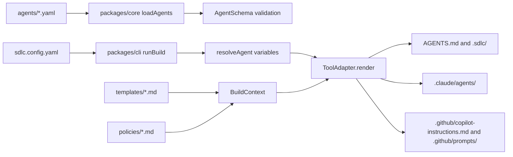
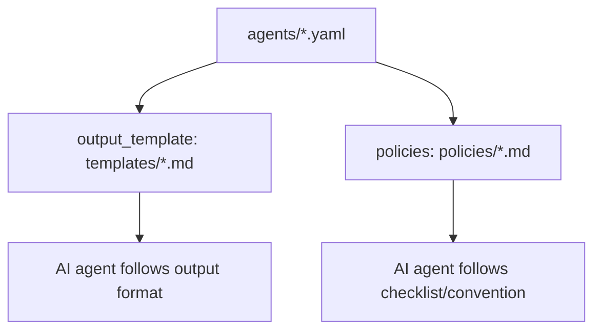

# Codebase Folder Guide - Agentic SDLC Agents Set

This document describes the current codebase of `sdlc-agent` after aligning with `docs/sa-design/SA_DESIGN_Agentic_SDLC_Agents_Set.md` and the actual source code in the repository.

The goal of the project is to maintain a set of AI agent definitions for the SDLC phases using a **Hybrid** approach: agents are written once in canonical YAML, and the build engine renders them into formats that various AI tools can read, such as `AGENTS.md`, `.sdlc/agents/*.md`, `.claude/agents/*.md`, and `.github/prompts/*.prompt.md`; end-users only interact with a short installer/wizard like `npx sdlc-agents init`.

## 0. What this project does and how to use it

`sdlc-agent` is a TypeScript monorepo to define, validate, build, and distribute a set of AI agents for SDLC phases: requirement, planning, architecture, coding, review, and testing. Instead of copying/pasting prompts for each tool individually, the project maintains a single source of truth in `agents/*.yaml`, which is then rendered into formats appropriate for various AI tools.

The current product direction is **Hybrid**:

- **Builder core:** the schema, validation, adapter rendering, drift detection, and test suite remain the primary technical foundation.
- **Installer UX:** end-users do not need to remember long command strings; `npx sdlc-agents init` will ask which AI host is being used, which agents to enable, project or user scope, and language/team variables, then automatically create the configuration and run the first build.

Product purpose according to SA design:

- Standardize the AI agent workflow for the software development team.
- Keep agent definitions, templates, and policies versioned, schema-validated, and tested.
- Build once for multiple targets: Universal (`AGENTS.md`, `.sdlc/agents/`), Claude Code (`.claude/agents/`), and GitHub Copilot (`.github/prompts/`, `.github/copilot-instructions.md`).
- Allow the team to customize incrementally via configuration, policies, templates, and adapters, while avoiding manual edits to generated outputs.

Current status: Phase 1 MVP is complete with 6 agents, CLI commands (`init` / `validate` / `build`), 3 adapters, validation contracts, drift detection, and basic test coverage. Larger features such as multi-layer configuration, `imports`, `extends`, registry/update flows, eval harnesses, and adapter plugin interfaces belong to Phase 2+.

Quick start for consumer projects:

```bash
npx sdlc-agents init
```

The wizard will ask for the AI host, agent preset, install scope, and variables, then create `sdlc.config.yaml` and render the output for the first time. In this repository, the commands `pnpm sdlc validate`, `pnpm sdlc build`, `pnpm test`, `pnpm typecheck`, and `pnpm lint` represent the maintainer/developer workflow, not the setup flow for end-users.

## 0.1 Quick folder overview

| Folder/File | Manually Edited? | Generated by Command? | Quick Meaning |
|---|---:|---:|---|
| `agents/` | Yes | No | Source of truth for the agent catalog. Modify when adding an agent, changing workflows, inputs, model hints, or policy/template references. |
| `templates/` | Yes | No | Output templates that agents must use, e.g., PRD, HLD, plans, review reports, test plans. |
| `policies/` | Yes | No | Checklists/conventions used by agents, such as coding conventions and security checklists. |
| `sdlc.config.yaml` | Yes | No | Configures rendering targets (`universal`, `claude-code`, `copilot`) and variables like `language`. |
| `packages/core/` | Yes | No | Schemas, config loaders, YAML loaders, variable resolvers, config mergers, and shared adapter types. |
| `packages/cli/` | Yes | No | CLI commands `sdlc init`, `sdlc validate`, `sdlc build`. Phase 2 will expand `init` into an interactive installer/wizard with host detection, agent presets, and initial build. |
| `packages/adapters/` | Yes | No | Renderers for each AI tool. Edit here when the output formats of Claude/Copilot/Universal change. |
| `docs/**/*.md` | Yes | No | Source of truth for documentation. When changing documentation content, modify the Markdown first. |
| `docs/**/*.html` | Yes, but must mirror MD | No | Rendered documentation view. Must be updated alongside the Markdown to prevent drift. |
| `AGENTS.md` | No | Yes, via `pnpm sdlc build` | Universal index for AI tools to read repository instructions. |
| `.sdlc/agents/*.md` | No | Yes, via `pnpm sdlc build` | Universal per-agent Markdown files. |
| `.sdlc/build-manifest.json` | No | Yes, via `pnpm sdlc build` | Hash manifest used to detect manually edited generated files. |
| `.claude/agents/*.md` | No | Yes, via `pnpm sdlc build` | Claude Code subagent files. |
| `.github/copilot-instructions.md` | No | Yes, via `pnpm sdlc build` | Copilot repository instructions. |
| `.github/prompts/*.prompt.md` | No | Yes, via `pnpm sdlc build` | Copilot prompt files for each agent. |
| `.github/workflows/` | Yes | No | CI: installs, lints, typechecks, tests, spikes. |
| `spike/` | Rarely | No | Phase 0 prototype kept as a reference. Not the main runtime. |
| `node_modules/` | No | Yes, via `pnpm install` | Dependency installation output. Do not commit or edit manually. |
| `pnpm-lock.yaml` | Not manually | Yes, via `pnpm install` | Dependency lockfile. Only changed via package manager. |
| `sdlc-phase1.bundle` | Rarely | No | Git bundle artifact of phase 1, not a runtime source. |

## 1. Architecture Overview

According to the SA design, the system has 4 main layers:

1. Canonical Layer
   - Contains the source of truth for agents, templates, policies, and configuration.
   - In the current codebase, this layer resides mainly in `agents/`, `templates/`, `policies/`, and `sdlc.config.yaml`.

2. Build Engine
   - Reads the configuration, loads YAML agents, validates schemas, resolves variables, and renders outputs.
   - In the current codebase, the build engine is split into `packages/core/` and `packages/cli/`.

3. Installer / Wizard UX
   - Asks for or detects the AI host, agent presets, install scope, and variables.
   - Creates the configuration and calls the build engine to provide a one-command setup experience for end-users.
   - This is the Hybrid direction, similar to the experience of `npx skills` / `create-vue`, while keeping the canonical YAML/build engine as the source of truth.

4. Tool Adapters
   - Converts canonical agents into specific formats for each AI tool.
   - Currently, there are 3 adapters: `universal`, `claude-code`, and `copilot` inside `packages/adapters/`.

Actual Build Flow:



## 2. Root Folder and Root Files

### `package.json`

The root package file of the `sdlc-agents` monorepo.

Key functions:

- Declares the project private and specifies the package manager `pnpm@9.15.0`.
- Contains dev/build/test scripts:
  - `pnpm sdlc`: runs CLI using `tsx packages/cli/src/index.ts`.
  - `pnpm spike`: runs the prototype renderer at `spike/render.ts`.
  - `pnpm typecheck`: runs `tsc --noEmit`.
  - `pnpm test`: runs `vitest run`.
  - `pnpm build`: runs `pnpm typecheck` to avoid a no-op build script.
  - `pnpm lint`: runs `biome check .`.
- Declares current runtime dependencies:
  - `yaml`: parses YAML agents and configurations.
  - `zod`: validates agent and configuration schemas.
- Declares dev tooling:
  - TypeScript, Vitest, Vite, tsx, Biome.

### `pnpm-workspace.yaml`

Defines the workspace packages:

- `packages/*`
- `packages/adapters/*`

Thanks to this file, packages like `@sdlc-agents/core`, `@sdlc-agents/cli`, and `@sdlc-agents/adapter-universal` can depend on each other using `workspace:*`.

### `pnpm-lock.yaml`

The pnpm lockfile. Records the dependency tree and links workspace packages.

In this codebase, the lockfile contains importers for:

- Root project.
- `packages/core`.
- `packages/cli`.
- `packages/adapters/claude-code`.
- `packages/adapters/copilot`.
- `packages/adapters/universal`.

### `tsconfig.json`

Shared TypeScript configuration for the repository.

Key points:

- `target: ES2022`.
- `module: ESNext`.
- `moduleResolution: bundler`.
- `strict: true`.
- Path aliases:
  - `@sdlc-agents/core` -> `./packages/core/src/index.ts`.
- Included files:
  - `packages/*/src/**/*`
  - `spike/**/*`
- Excluded paths:
  - `node_modules`
  - `dist`
  - `spike/output`

Note: the pattern `packages/*/src/**/*` matches `packages/core/src` and `packages/cli/src`, but for adapters located at `packages/adapters/<adapter>/src`, the typecheck depends on how TypeScript resolves package imports and test files. Currently, `pnpm typecheck` passes successfully.

### `vitest.config.ts`

Test runner configuration.

Currently includes:

```ts
test: {
  include: [
    "packages/*/src/**/*.test.ts",
    "packages/adapters/*/src/**/*.test.ts",
  ],
}
```

The specific pattern `packages/adapters/*/src/**/*.test.ts` ensures adapter tests are always run alongside core and CLI tests. The current run executes 9 test files / 60 tests.

### `sdlc.config.yaml`

The build engine runtime configuration.

Functions:

- Declares targets to render:
  - `universal`
  - `claude-code`
  - `copilot`
- Declares variables to inject into agent text:
  - `language: en`
  - contains commented-out examples for `team`.

CLI `runBuild()` reads this file via `loadConfig(cwd)`. If the file does not exist, `packages/core/src/config.ts` falls back to defaults:

- targets: `["universal", "claude-code"]`
- variables: `{ language: "en" }`
- agentsDir: `"agents"`

### `AGENTS.md`

Output generated by the universal adapter.

Functions:

- Acts as the entry point according to the `AGENTS.md` convention.
- Lists available agents and links to `.sdlc/agents/*.md`.
- Instructs how to invoke agents on Claude Code, Cursor, Windsurf, Codex, Gemini CLI, and other tools that read Markdown.

This file is regenerated when running `sdlc build`. Do not edit it manually if changes need to be permanent; edit the sources in `agents/`, `templates/`, `policies/`, or the adapter renderer instead.

### `.gitignore`

Ignores dependencies, caches, and build outputs:

- `node_modules/`
- `dist/`, `out/`, `build/`
- `.next/`, `.nuxt/`, `.turbo/`
- `spike/output/`
- logs, coverage, env files, IDE files, OS files, cache files.

### `sdlc-phase1.bundle`

Git bundle artifact of phase 1. This is a binary-ish artifact to store/exchange commit history or Git snapshots.

Not a runtime source of the build engine. To inspect its contents, use Git commands such as:

```bash
git bundle verify sdlc-phase1.bundle
git bundle list-heads sdlc-phase1.bundle
```

## 3. `agents/` - canonical agent definitions

`agents/` is the most important source of truth for the agent catalog. Each YAML file defines an agent matching the schema in `packages/core/src/schema.ts`.

Currently contains 6 MVP agents:

| File | Agent | Phase | Function |
|---|---|---|---|
| `agents/requirement-analyst.yaml` | `requirement-analyst` | `requirement` | Clarifies vague requirements, creates PRDs, user stories, acceptance criteria, and out-of-scope lists. |
| `agents/solution-architect.yaml` | `solution-architect` | `architecture` | Creates HLDs/ADRs, compares architecture trade-offs, draws diagrams, and lists open questions. |
| `agents/planner.yaml` | `planner` | `planning` | Transforms PRDs/specs into implementation plans, tasks, dependencies, efforts, and risks. |
| `agents/coder.yaml` | `coder` | `coding` | Implements tasks according to TDD: red, green, refactor, run tests, commit. |
| `agents/test-generator.yaml` | `test-generator` | `testing` | Generates test plans and test code from specs/sources, including happy paths and edge cases. |
| `agents/code-reviewer.yaml` | `code-reviewer` | `review` | Reviews PR diffs against security, performance, and convention checklists. |

### YAML Agent Structure

Each agent consists of these key fields:

- `id`: kebab-case, e.g., `code-reviewer`.
- `version`: SemVer `x.y.z`.
- `phase`: one of the valid phases in the schema.
- `description`: agent description; used by adapters for triggers or display.
- `model_hint`: `fast`, `balanced`, or `high-reasoning`.
- `model_variants`: model-specific prompt appends/prepends; currently the schema supports `claude`, `copilot`, `gemini`, `codex`.
- `tools_required`: list of tools the agent is expected to use.
- `inputs`: list of inputs required by the agent.
- `workflow`: mandatory steps the agent must perform.
- `output_template`: reference to the output template file in `templates/`.
- `policies`: list of policy references in `policies/`.
- `imports`, `prompt_prepend`, `extends`: schema support exists, but import/extension logic is not yet fully implemented in the current build engine.

### When to edit this folder

Modify `agents/` when you want to:

- Add a new agent.
- Change an agent's workflow.
- Change the phase, description, model hint, or required tools.
- Link policies or templates to an agent.
- Add tool-specific prompt variants for Claude/Copilot/Gemini/Codex.

After editing, run:

```bash
pnpm sdlc validate
pnpm sdlc build
pnpm test
```

## 4. `templates/` - output templates

`templates/` contains the document patterns that agents use when generating outputs.

Currently contains:

- `templates/plan.md`: implementation plan template for `planner`.
- `templates/review-report.md`: review report template for `code-reviewer`.
- `templates/prd.md`: PRD template for `requirement-analyst`.
- `templates/hld.md`: HLD/ADR template for `solution-architect`.
- `templates/test-plan.md`: test plan template for `test-generator`.

### Current Implementation Status

CLI `runBuild()` loads the `templates/` folder into `BuildContext.templates`, but current adapters only render reference strings:

```md
Use template `templates/plan.md`.
```

No logic exists to expand the template body into generated agent files. This means templates currently act as guidelines for AI agents rather than text compiled into the prompt body.

### When to edit this folder

Modify `templates/` when you want to change output document formats:

- PRD format.
- HLD/ADR format.
- Plan format.
- Review report format.
- Test plan format.

## 5. `policies/` - checklists and coding policies

`policies/` contains guidelines and checklists used by agents.

Currently contains:

- `policies/conventions.md`
  - Naming conventions.
  - Function length guidance.
  - Error handling.
  - Testing expectations.
  - TypeScript rules.

- `policies/security-checklist.md`
  - Input validation.
  - Auth/authz.
  - Secrets.
  - Dependency review.
  - Logging/PII.

### Current Implementation Status

Similar to templates, policies are loaded into `BuildContext.policies`, but current adapters only render references/links to the policy files. Policy content is not inlined into generated prompts.

The universal adapter renders links as:

```md
- [`conventions`](../../policies/conventions.md)
```

The Claude adapter renders:

```md
- `policies/conventions.md`
```

The Copilot adapter does not render the policies section in prompt files at all, except when mentioned in workflow/output instructions. If Copilot prompts require explicit policies, the adapter must be extended.

## 6. `packages/core/` - build engine core

`packages/core/` is the core library, independent of the CLI UI. It provides schemas, loaders, configs, resolvers, mergers, and shared types.

### `packages/core/package.json`

Package manifest for `@sdlc-agents/core`.

Functions:

- Declares a private ESM package.
- Exports `./src/index.ts`.
- Depends on `yaml` and `zod`.

### `packages/core/src/schema.ts`

Defines the Zod schema for canonical agents.

Core components:

- `ModelHint`: enum `fast`, `balanced`, `high-reasoning`.
- `WorkflowStep`: object with `step` and optional `ref`.
- `ImportEntry`: object for importing skills from GitHub matching `github:owner/repo`, with a `path`, `pin`, and valid license.
- `InputDef`: agent input definition with `name`, optional `description`, and `required` defaulting to `false`.
- `ModelVariant`: optional `prompt_append` and `prompt_prepend`.
- `AgentSchema`: the comprehensive schema.
- `AgentDef`: type inferred from `AgentSchema`.

Key validations:

- `id` must be kebab-case.
- `version` must be SemVer `x.y.z`.
- `phase` must belong to the permitted phases list.
- `description` must be at least 10 characters long.
- `workflow` must contain at least 1 step.
- `imports.license` only allows MIT, Apache-2.0, BSD-2-Clause, and BSD-3-Clause.

### `packages/core/src/types.ts`

Contains shared interfaces for the build engine and adapters.

Interfaces:

- `OutputFile`
  - `path`: output path relative to the consumer project root.
  - `content`: file content.

- `Diagnostic`
  - `severity`: `error`, `warning`, `info`.
  - `message`: diagnostic message.
  - `source`: optional source file.

- `ResolvedConfig`
  - `targets`: list of adapter targets.
  - `rootDir`: absolute root of the project.
  - `variables`: variables used for `{{...}}`.
  - `agentsDir`: folder containing agent definitions.

- `BuildContext`
  - `config`: resolved configuration.
  - `templates`: map of template filenames -> contents.
  - `policies`: map of policy names -> contents.

- `ToolAdapter`
  - `name`: adapter name.
  - `render(agents, ctx)`: returns a list of output files.
  - `validate?(outputs)`: optional validation hook, currently unimplemented by any adapter.

### `packages/core/src/config.ts`

Reads `sdlc.config.yaml`.

Flow:

1. Creates default configuration:
   - targets: `["universal", "claude-code"]`
   - rootDir: absolute path of the input directory.
   - variables: `{ language: "en" }`
   - agentsDir: `"agents"`
2. Checks for `sdlc.config.yaml`.
3. If it does not exist, returns defaults.
4. If it exists:
   - reads raw UTF-8 content.
   - parses YAML.
   - validates using `ConfigFileSchema`.
   - merges parsed configuration onto defaults.
   - merges `variables` separately to preserve default variables.

The config schema currently supports:

- `targets?: string[]`
- `variables?: Record<string, string>`
- `agentsDir?: string`

### `packages/core/src/loader.ts`

Loads agent YAML files from the specified folder.

Flow:

1. Runs `readdirSync(dir)`.
2. Filters for `.yaml` files.
3. Sorts files to ensure deterministic output.
4. Reads each file as UTF-8.
5. Parses YAML via `yaml.parse`.
6. Validates via `AgentSchema.parse`.
7. Returns `AgentDef[]`.

If the YAML is invalid, the function throws a ZodError or a parsing error.

### `packages/core/src/merger.ts`

Provides `mergeConfigs(base, ...overrides)`.

Functions:

- Merges scalar fields in order: later overrides overwrite earlier ones.
- Deep-merges `variables` separately.
- Does not mutate the base configuration.

Currently, the CLI flow does not call `mergeConfigs()`, but it serves as the foundation for the multi-layer customization described in the SA design: base -> org -> team -> project -> local.

### `packages/core/src/resolver.ts`

Resolves variables inside agents.

Functions:

- `resolveVariables(text, vars)`
  - Replaces `{{key}}` with `vars[key]`.
  - Keeps placeholders intact if keys do not exist.
  - Current regex only matches word characters: `/\{\{(\w+)\}\}/g`.

- `resolveAgent(agent, vars)`
  - Traverses the object/array/string recursively.
  - Resolves variables in each string field.
  - Avoids running global replaces on JSON strings, making it safer against quotes, slashes, and newlines in variable values.

Key points:

- Does not mutate the original agent.
- Only supports simple placeholders like `{{language}}`, `{{team}}`; does not support expressions like `{{stack | default: "not specified"}}` in templates.

### `packages/core/src/index.ts`

Public barrel export of the core package.

Exports:

- Functions: `loadConfig`, `loadAgents`, `mergeConfigs`, `resolveAgent`, `resolveVariables`.
- Schemas/types: `AgentSchema`, `AgentDef`.
- Shared types: `BuildContext`, `Diagnostic`, `OutputFile`, `ResolvedConfig`, `ToolAdapter`.

### `packages/core/src/__tests__/`

Unit tests for core components.

- `schema.test.ts`
  - Valid agents pass.
  - Uppercase IDs fail.
  - Non-SemVer versions fail.
  - Unknown phases fail.
  - Empty workflows fail.
  - Short descriptions fail.
  - `model_hint` defaults to `balanced`.
  - Import source/license validations.

- `loader.test.ts`
  - Loads all `.yaml` files.
  - Ignores non-YAML files.
  - Throws when invalid YAML violates the schema.

- `merger.test.ts`
  - Scalar overrides.
  - Deep-merges variables.
  - Preserves base.
  - Last override wins.
  - Does not mutate base.

- `resolver.test.ts`
  - Replaces known variables.
  - Leaves unknown variables.
  - Multiple occurrences.
  - Resolves inside agent objects.
  - Does not mutate original.

### `packages/core/src/__fixtures__/`

Test fixtures:

- `valid/`
  - `planner.yaml`
  - `code-reviewer.yaml`
  - `README.md` to test ignoring non-YAML.
- `invalid/`
  - `bad.yaml` to test validation failures.

## 7. `packages/cli/` - command line interface

`packages/cli/` is the CLI package `@sdlc-agents/cli`. In Phase 1, it acts primarily as a build/validate tool for maintainers. Under the Hybrid model, `sdlc init` will become the installer entrypoint for end-users: asking for tools/agents/scopes/variables, generating configurations, and executing validation + initial builds.

### `packages/cli/package.json`

Functions:

- Private ESM package.
- Bin `sdlc` points to `./src/index.ts`.
- Depends on:
  - `@sdlc-agents/core`
  - `@sdlc-agents/adapter-universal`
  - `@sdlc-agents/adapter-claude-code`
  - `@sdlc-agents/adapter-copilot`
  - `commander`

### `packages/cli/src/index.ts`

CLI entrypoint.

Uses `commander` to define:

- `sdlc build`
  - Option `-C, --cwd <dir>`.
  - Calls `runBuild(opts.cwd)`.

- `sdlc validate`
  - Option `-C, --cwd <dir>`.
  - Calls `runValidate(opts.cwd)`.
  - `runValidate()` reads `sdlc.config.yaml`, validates `targets`, and loads agents from `config.agentsDir`.
  - Exits with `process.exit(1)` on failure.

- `sdlc init`
  - Option `-C, --cwd <dir>`.
  - Calls `runInit(opts.cwd)`.

The current CLI version is `0.1.0`.

### `packages/cli/src/commands/build.ts`

Handles the actual orchestration of the build engine.

Detailed flow:

1. `loadConfig(cwd)`.
2. Resolves `agentsDir = path.join(cwd, config.agentsDir)`.
3. `loadAgents(agentsDir)`.
4. Resolves variables for each agent via `resolveAgent(a, config.variables)`.
5. Creates `BuildContext`:
   - `config`
   - `templates: loadDir(path.join(cwd, "templates"))`
   - `policies: loadDir(path.join(cwd, "policies"))`
6. Loops through `config.targets`.
7. Resolves adapters in the map:
   - `universal`
   - `claude-code`
   - `copilot`
8. Warns and skips if a target is unknown.
9. Calls `adapter.render(agents, ctx)`.
10. Writes output files to disk:
    - Recursively creates folders.
    - Writes UTF-8.
11. Logs files written per adapter and total counts.

Helper `loadDir(dir)`:

- Returns an empty `Map` if the directory does not exist.
- Only loads files directly in the folder, does not recurse.

### `packages/cli/src/commands/validate.ts`

Validates all agent YAML configurations.

Flow:

1. Calls `loadAgents(agentsDir)`.
2. On success, logs valid agent counts and returns `true`.
3. Catches `ZodError` and prints issues by path/message.
4. On other errors, prints `String(err)`.
5. Returns `false`.

### `packages/cli/src/commands/init.ts`

Scaffolds a default configuration.

This is where the interactive installer/wizard will be developed in Phase 2. The wizard should not inject rendering logic into adapters; it should only gather user choices, write the configuration, select targets/agents, and trigger the build engine.

Flow:

1. Sets output target to `<cwd>/sdlc.config.yaml`.
2. Skips and logs if the file already exists.
3. If missing, writes `DEFAULT_CONFIG`.
4. Logs the next step: `sdlc build`.

The default configuration includes 3 targets:

- `universal`
- `claude-code`
- `copilot`

### `packages/cli/src/__tests__/`

CLI tests:

- `build.test.ts`
  - Creates a temporary project.
  - Copies real `agents/`.
  - Writes a temporary `sdlc.config.yaml`.
  - Verifies the build generates `AGENTS.md`.
  - Verifies the build generates `.claude/agents/*.md`.
  - Verifies build idempotency: consecutive runs produce identical outputs.

- `validate.test.ts`
  - Verifies real `agents/` pass validation.

## 8. `packages/adapters/` - render targets

`packages/adapters/` contains adapter packages, each implementing the `ToolAdapter` interface.

### `packages/adapters/universal/`

The universal adapter renders portable formats.

Outputs:

- `AGENTS.md`
- `.sdlc/agents/<agent-id>.md` for each agent.

`UniversalAdapter.render()` returns:

```ts
[
  { path: "AGENTS.md", content: this.renderIndex(agents) },
  ...agents.map((a) => ({
    path: `.sdlc/agents/${a.id}.md`,
    content: this.renderAgent(a),
  })),
]
```

`renderIndex()` generates:

- Title `# SDLC Agents`.
- Invocation instructions.
- Table of agents: ID, phase, first line of description.
- Generated footer.

`renderAgent()` generates:

- Heading with agent ID.
- Phase, version, model.
- Description.
- Inputs.
- Workflow.
- Optional output template reference.
- Optional policy links.
- Universal footer.

Used for:

- Codex.
- Cursor.
- Windsurf.
- Gemini CLI.
- Any AI tool that reads `AGENTS.md` and Markdown.

Tests:

- Verifies adapter name.
- Verifies output paths.
- Verifies `AGENTS.md` contains ID/phase.
- Verifies agent file contains the workflow.
- Snapshot test for `AGENTS.md`.

### `packages/adapters/claude-code/`

Native adapter for Claude Code subagents.

Outputs:

- `.claude/agents/<agent-id>.md` for each agent.

Render characteristics:

- YAML frontmatter:
  - `name`
  - `description`
  - `model`
  - `tools`
- Body Markdown contains:
  - title.
  - description.
  - Claude-specific prompt append if `agent.model_variants.claude.prompt_append` exists.
  - inputs.
  - workflow.
  - output template reference.
  - policy references.
  - generated footer.

Model mapping:

| `model_hint` | Claude model output |
|---|---|
| `fast` | `claude-haiku-4-5-20251001` |
| `balanced` | `claude-sonnet-4-6` |
| `high-reasoning` | `claude-opus-4-8` |

Tests:

- Verifies adapter name.
- Verifies each agent renders to one file.
- Verifies YAML frontmatter contains name/model.
- Verifies workflow steps.
- Verifies Claude-specific notes.
- Snapshot test.

### `packages/adapters/copilot/`

Native adapter for GitHub Copilot.

Outputs:

- `.github/copilot-instructions.md`
- `.github/prompts/<agent-id>.prompt.md` for each agent.

`renderInstructions()` generates:

- Title `# SDLC Agents - Copilot Instructions`.
- Activation guidelines.
- List of agents and linked prompt files.

`renderPrompt()` generates prompt files:

- YAML frontmatter:
  - `mode: agent`
  - `description`
- Body:
  - agent title/phase.
  - description.
  - optional Copilot note from `model_variants.copilot.prompt_append`.
  - inputs.
  - workflow.
  - optional output template reference.
  - generated footer.

Note: the Copilot adapter currently does not render the policies section, meaning policies are only represented if mentioned within agent workflow steps.

Tests:

- Verifies adapter name.
- Verifies output instructions and prompt files.
- Verifies instructions list all agents.
- Verifies prompts contain the workflow.
- Snapshot test.

## 9. Generated output folders

Generated outputs are files created from `agents/` via adapters. General policy: do not edit manually if you want changes to persist; edit canonical sources or adapters, then run `pnpm sdlc build`.

### `.sdlc/`

Universal generated folder.

Currently contains:

- `.sdlc/agents/code-reviewer.md`
- `.sdlc/agents/coder.md`
- `.sdlc/agents/planner.md`
- `.sdlc/agents/requirement-analyst.md`
- `.sdlc/agents/solution-architect.md`
- `.sdlc/agents/test-generator.md`

Each file is portable Markdown:

- Phase/version/model.
- Agent description.
- Inputs.
- Workflow.
- Output template reference.
- Policy references (if any).

This folder is a companion of the root `AGENTS.md`.

### `.claude/`

Claude Code generated folder.

Currently contains:

- `.claude/agents/*.md` for all 6 agents.

Each file contains YAML frontmatter suitable for Claude Code subagents:

- `name`
- `description`
- `model`
- `tools`

The body contains detailed workflows and Claude-specific notes if `model_variants.claude` is specified.

### `.github/`

GitHub-related folder.

Generated Copilot outputs:

- `.github/copilot-instructions.md`
- `.github/prompts/*.prompt.md`

CI workflow:

- `.github/workflows/ci.yml`

Important note about CI:

- The workflow currently configures `paths` and `working-directory` matching `AI_Agent_SDLC_set/**`.
- The actual repository source code resides at the root (`packages/`, `agents/`, `templates/`, ...), not inside a nested folder `AI_Agent_SDLC_set/`.
- If the CI is expected to run on the current repository root, the workflow must be reviewed and updated. This document only records the fact without making modifications.

## 10. `docs/` - design and planning docs

### `docs/sa-design/SA_DESIGN_Agentic_SDLC_Agents_Set.md`

Original solution architecture document.

Defines:

- Product vision: multi-platform reusable agent definition library.
- Problem statement: individual prompts/agent configs per team cause duplication and inconsistent quality.
- Goals/non-goals.
- Personas and use cases.
- Agent catalog by SDLC phase.
- Architecture:
  - canonical layer.
  - build engine.
  - universal adapter.
  - native adapters.
  - config/customization layer.
  - distribution.
- Sample YAML agent DSL.
- Roadmap phases 0/1/2/3.
- Risks/mitigations.
- Skill ecosystem reuse strategy.

### `docs/superpowers/plans/2026-06-10-phase1-build-engine.md`

Implementation plan for the Phase 1 build engine.

Used to track:

- Rationale for splitting into core/CLI/adapters.
- Scope of work for Phase 1.
- Tasks and acceptance criteria.

### `docs/codebase-guide/CODEBASE_FOLDER_GUIDE.md`

This current file. Acts as a bridge between the SA design and the actual code.

## 11. `spike/` - prototype phase 0

`spike/render.ts` is the standalone prototype of the phase 0 build engine.

Functions:

- Defines an inline `AgentSchema` specific to the spike.
- Loads `agents/*.yaml`.
- Validates via Zod.
- Renders:
  - Claude Code output to `spike/output/claude-code/.claude/agents/*.md`.
  - Universal output to `spike/output/universal/AGENTS.md` and `.sdlc/agents/*.md`.

Differences from the current implementation:

- Schema is defined inline, without utilizing `@sdlc-agents/core`.
- Only renders Claude Code and Universal targets; Copilot is not supported.
- Output folder `spike/output/` is ignored by `.gitignore`.

Role:

- Preserves initial proof-of-concept design.
- Can be used for comparative references, but production code resides in `packages/core`, `packages/cli`, and `packages/adapters`.

## 12. `examples/` - placeholder

`examples/` is currently an empty directory.

According to the SA design, this folder is intended to hold pre-built demo projects for each tool/adapter.

Future additions:

- Example repository utilizing universal output.
- Example repository utilizing Claude Code subagents.
- Example repository utilizing Copilot prompts.
- Golden samples for docs/tutorials.

## 13. `skills/` - placeholder

`skills/` is currently an empty directory.

According to the SA design, this folder will contain detailed workflows/skills that agents can import or reference.

The schema already supports `imports`, `prompt_prepend`, and `extends`, but the build engine loader has not yet implemented:

- Vendoring external skills.
- Pinning imports by commit/tag.
- Runtime license checks.
- Inlining/wrapping imported skill contents.

When the import/community skill reuse is implemented in later phases, this folder will house local or vendored skills.

## 14. Relationships between policies, templates, and agents

These three folders form the canonical content layer:



In the current code:

- `agents/*.yaml` is strictly validated against the schema.
- `templates/*.md` and `policies/*.md` are loaded into the build context but cross-reference validation is not fully enforced.
- If an agent references a template/policy that does not exist, the build may still succeed because the adapter only renders string references/links.

Current risks:

- Potential dangling template/policy references that tests do not catch.
- Copilot output does not clearly render the policies section.
- Template syntax like `{{#each tasks}}` is not parsed by the engine; it serves solely as instructions for the AI or a placeholder for future features.

## 15. Current Test Strategy

Current testing focuses on:

- Schema correctness.
- YAML loading.
- Config merging.
- Variable resolution.
- CLI build/validate commands.
- Adapter rendering contracts and snapshots.

Recently run validation commands:

```bash
pnpm test
pnpm typecheck
```

Most recent results:

- `pnpm test`: 6 test files pass, 29 tests pass.
- `pnpm typecheck`: passes.

## 16. How to add a new agent

Recommended workflow:

1. Create a file `agents/<new-agent-id>.yaml`.
2. Ensure `id` is kebab-case and `version` is SemVer.
3. Select a `phase` matching the schema enum.
4. Write a clear `description` useful for routing.
5. Add `inputs`, `workflow`, and `tools_required`.
6. If there is an output format, create/edit the file in `templates/`.
7. If a checklist is needed, create/edit the file in `policies/`.
8. Run validation:

```bash
pnpm sdlc validate
```

9. Render outputs:

```bash
pnpm sdlc build
```

10. Run tests and typechecks:

```bash
pnpm test
pnpm typecheck
```

## 17. How to add a new adapter

Following the established pattern:

1. Create a new package under `packages/adapters/<tool-name>/`.
2. Add a `package.json` depending on `@sdlc-agents/core`.
3. Implement a class `<ToolName>Adapter implements ToolAdapter`.
4. Implement `render(agents, ctx)` returning `OutputFile[]`.
5. Add tests and snapshots if the output format is stable.
6. Add the package to the dependencies of `packages/cli/package.json`.
7. Import the adapter in `packages/cli/src/commands/build.ts`.
8. Register it in the `ADAPTERS` map:

```ts
const ADAPTERS: Record<string, ToolAdapter> = {
  universal: new UniversalAdapter(),
  "claude-code": new ClaudeCodeAdapter(),
  copilot: new CopilotAdapter(),
  "<tool-name>": new ToolNameAdapter(),
};
```

9. Add the target to `sdlc.config.yaml`.
10. Run `pnpm install`, `pnpm test`, `pnpm typecheck`, and `pnpm sdlc build`.

## 18. Key points to note when continuing development

### 18.1 CodeGraph

The repository has not initialized CodeGraph yet. When you need to answer larger structural questions, run:

```bash
codegraph init -i
```

Then use `codegraph_context`, `codegraph_explore`, and `codegraph_files` to understand the architecture faster.

### 18.2 Terminal Encoding Output

Some terminal outputs on Windows may experience Mojibake (incorrect character encoding) for Unicode/Vietnamese/emoji characters. Source files are UTF-8; to verify contents accurately, read them inside an editor or with an encoding-aware terminal.

### 18.3 Missing Template Engine

Templates currently use placeholder/Handlebars-like syntax, but the build engine does not yet have a template rendering engine. This works fine for AI prompts, but if you expect the build engine to generate final documents from structured data, a template renderer must be implemented.

### 18.4 Multi-layer configuration not wired to the CLI

The SA design mentions a 5-layer configuration merge. The core codebase provides `mergeConfigs()`, but `runBuild()` only reads a single `sdlc.config.yaml`. Multi-layer configuration must be wired in Phase 2 to match the design.

### 18.5 `imports` and `extends` only exist in the schema

The schema accepts `imports` and `extends`, but the loader/resolver/builder has not implemented semantic logic for:

- Agent inheritance.
- Skill vendoring.
- Runtime license enforcement.
- Diffing/bumping imported skills.

### 18.6 CI workflow needs review

`.github/workflows/ci.yml` is configured for the nested folder `AI_Agent_SDLC_set`. If the current repository root is the main project, the CI scope may be incorrect. The workflow should be updated if CI is intended to run on the repository root.

## 19. Quick Folder Summary

| Folder/File | Type | Manually Edited? | Function |
|---|---|---:|---|
| `agents/` | Canonical source | Yes | Defines the 6 SDLC agents using YAML. |
| `templates/` | Canonical source | Yes | Templates for PRD, HLD, plans, reviews, and test plans. |
| `policies/` | Canonical source | Yes | Conventions and security checklists. |
| `packages/core/` | Code runtime | Yes | Schemas, configs, loaders, mergers, resolvers, and shared types. |
| `packages/cli/` | Code runtime | Yes | CLI commands `sdlc init/build/validate`; `init` hosts the interactive wizard. |
| `packages/adapters/` | Code runtime | Yes | Renders agents to universal, Claude Code, and Copilot. |
| `.sdlc/` | Generated output | Avoid | Universal per-agent markdown. |
| `.claude/` | Generated output | Avoid | Claude Code subagents. |
| `.github/prompts/` | Generated output | Avoid | Copilot prompt files. |
| `.github/copilot-instructions.md` | Generated output | Avoid | Copilot repository instructions. |
| `.github/workflows/` | CI config | Yes | GitHub Actions workflows (needs path review). |
| `docs/` | Documentation | Yes | SA design, codebase guide, adapter contract (each has dedicated subfolders + HTML viewer). |
| `spike/` | Prototype | With caution | Phase 0 renderer prototype. |
| `examples/` | Placeholder | Yes | Intended to hold demo projects. |
| `skills/` | Placeholder | Yes | Intended to hold local/vendored skills. |
| `node_modules/` | Dependency install | No | Generated by package manager. |
| `sdlc-phase1.bundle` | Git artifact | Rarely | Bundle artifact, not runtime source. |

## 20. Mental Model

To understand the project quickly:

1. `agents/*.yaml` is where agents are defined.
2. `packages/core` ensures agents are valid and resolves references.
3. `packages/cli` orchestrates builds.
4. `packages/adapters/*` determines the output files for each AI tool.
5. `.sdlc/`, `.claude/`, `.github/prompts/`, and `AGENTS.md` are the generated outputs.
6. `templates/` and `policies/` are reference documents helping agents generate output in the correct formats and guidelines.

## 21. Additional review comments after aligning SA design and codebase

This section is appended to preserve original documentation contents above. It summarizes assessments and proposals based on `docs/sa-design/SA_DESIGN_Agentic_SDLC_Agents_Set.md` and current code.

> **Update 2026-06-11:** Cross-checked against the codebase. Completed items are marked with ✅ along with code locations; detailed status is listed under 21.6.

### 21.1 Project Strengths

- Addresses a real pain point: teams currently duplicate prompts/agent configs per tool, which is hard to version, test, and standardize.
- The canonical DSL -> build engine -> adapters architecture is sound. `agents/*.yaml` acts as the single source of truth, and adapters only handle tool-specific packaging.
- Universal-first is a good decision. `AGENTS.md` and `.sdlc/agents/*.md` establish a portable baseline for Codex, Cursor, Windsurf, Gemini CLI, and any tool that reads repository files.
- The adapter pattern is clean and easy to extend: each adapter only needs to implement `ToolAdapter.render()`.
- Solid test suite for the MVP phase: schema tests, loader tests, resolver tests, CLI build/validate tests, and adapter snapshot tests (53 tests across 9 files).
- The SA design identifies long-term risks early: prompt supply-chains, versioning, eval harnesses, policy layers, and adapter compatibility.

### 21.2 Weaknesses and risks to manage

- The scope in the SA design is broad. Registries, update mechanisms, telemetry, eval harnesses, marketplaces, imported community skills, and multi-layer configs are valuable but might dilute focus if built too early.
- ✅ **Handled silent no-ops:** `imports` and `extends` exist in the schema but were previously skipped silently. Now `validate`/`build` fail explicitly with "not supported yet (planned: Phase 2)" (`packages/cli/src/commands/project-validation.ts`). `mergeConfigs` is not yet wired (waiting for Phase 2 multi-layer configs); `BuildContext.templates`/`policies` are loaded but adapters do not use them yet.
- Templates and policies currently serve as references (links/paths in outputs). The build engine validates cross-references (see 21.3.2) but does not inline template bodies — acceptable for the MVP.
- Be careful claiming "supports all AI tools." A more accurate description is: universal output creates a portable baseline for any tool that reads repository instructions; native UX/auto-routing still requires custom adapters and compatibility tests. The README has been updated to reflect this.
- ✅ **Added drift detection:** the build writes the SHA-256 hashes of generated files into `.sdlc/build-manifest.json`. During consecutive builds, if a file has been edited manually, the build warns "Drift detected" before overwriting it (`packages/cli/src/commands/build.ts`).

### 21.3 Proposals to incorporate into the SA design

1. ✅ Adapter Contract — **completed in `docs/adapter-contract/ADAPTER_CONTRACT.md`**
   - Documents the interface, required determinism, output paths of the 3 adapters, mandatory generated footer marker (`Generated by sdlc-agents`), testing expectations (path, content, snapshot contracts), and workflows for adding new adapters.

2. ✅ Reference Validation — **implemented in `packages/cli/src/commands/project-validation.ts`**, runs on both `validate` and `build`:
   - Fails if `output_template` points to a file that does not exist.
   - Fails if `policies` references a policy that does not exist.
   - Fails if there are duplicate agent IDs.
   - Fails if agents use `extends`/`imports` (not supported yet — avoids silent no-ops).
   - Covered by tests in `packages/cli/src/__tests__/validate.test.ts`.

3. ✅ Generated Output Strategy — **decided and implemented**
   - Generated files (`AGENTS.md`, `.sdlc/`, `.claude/agents/`, `.github/prompts/`, `.github/copilot-instructions.md`) are committed so consumers can use them immediately without running builds; they should not be modified manually.
   - All generated files contain the footer marker `Generated by sdlc-agents` (standardized across universal files too).
   - Drift detection via `.sdlc/build-manifest.json` warns of manual edits before regenerating from canonical sources.

4. MVP exit criteria — **status of each criterion:**
   - ✅ `validate` catches schema errors, duplicate IDs, missing template/policy refs, and unsupported fields.
   - ✅ `build` is deterministic (idempotency tests in place).
   - ✅ 3 adapters have snapshot/contract tests.
   - ✅ CI runs on the root project (`.github/workflows/ci.yml`: lint → typecheck → test → spike). Lint passes after adding `biome.json` (excluding docs viewer files, formatting all source files).
   - ✅ README quickstart exists at root: install → validate → build → use agent.
   - ⬜ Remaining Phase 1 items in SA design: dogfooding + 1 pilot team outside the dev team.

5. Eval should be deferred — **retain this recommendation**
   - Phase 1 focuses on static tests, schema validation, and snapshots (as implemented).
   - Phase 2 will introduce promptfoo/golden cases/model eval to avoid early complexity.

6. Prompt supply-chain security — **not yet implemented, but guarded**
   - `imports` are blocked by validation until a vendor + pin + license check mechanism is established (Phase 2).
   - When implemented: imported skills should be disabled by default until reviewed; lockfile/manifest stores source, license, pin, and hash; auto-updates from mutable branches/tags are banned.

### 21.4 Technical Priorities — Status

| # | Task | Status | Notes |
|---|------|-----------|---------|
| 1 | Run CI workflow on root project | ✅ Done | `.github/workflows/ci.yml` — lint fixed via `biome.json` and formatting all source files |
| 2 | Include adapter tests in Vitest | ✅ Done | `vitest.config.ts` includes specific patterns for `packages/adapters/*/src` |
| 3 | Validate duplicate IDs + missing refs | ✅ Done | `project-validation.ts` + tests |
| 4 | Generated markers / drift detection | ✅ Done | SHA-256 manifest at `.sdlc/build-manifest.json`, warnings during builds, standardized footers |
| 5 | README quickstart | ✅ Done | `README.md` at root |
| 6 | Document adapter contract | ✅ Done | `docs/adapter-contract/ADAPTER_CONTRACT.md` |
| 7 | Multi-layer config, imports, extends, eval harness | ⬜ Phase 2 | `extends`/`imports` are blocked by validation; `mergeConfigs` is in core waiting to be wired |

### 21.5 Evaluation Conclusions

The project has a solid foundation and addresses the right problem: turning prompt/agent workflows into schemas, versions, builds, and testable artifacts. The biggest value lies not in individual prompts, but in standardizing how teams package and distribute SDLC agents across multiple AI tools.

The next steps should keep the MVP minimal: canonical agents, deterministic builds, 3 adapters, strict validation, and correct CI. Once this core is stable, larger Phase 2 features (registries, community skill imports, eval harnesses, update mechanisms) will be much easier to implement.

### 21.6 SA Design ↔ Code Comparison (Snapshot 2026-06-11)

Functional Requirements alignment with code:

| FR | Description | Status | Code Location |
|----|----------|-----------|-------------|
| FR-01 | Standard DSL (YAML) + schema validation | ✅ Done (Zod; editor JSON Schema export pending) | `packages/core/src/schema.ts` |
| FR-02 | Universal adapter (AGENTS.md + `.sdlc/`) | ✅ Done | `packages/adapters/universal` |
| FR-02b | Native adapters: Claude Code, Copilot | ✅ Done | `packages/adapters/claude-code`, `packages/adapters/copilot` |
| FR-03 | Full CLI + Hybrid installer UX | 🟡 Partial: `init`/`build`/`validate` done; interactive wizard, host detection, update/list/doctor/eject/reset pending | `packages/cli/src/index.ts`, `packages/cli/src/commands/init.ts` |
| FR-04 | Multi-layer config overrides | ⬜ Pending — reads single `sdlc.config.yaml`; `mergeConfigs` in core waiting to be wired | `packages/core/src/config.ts`, `merger.ts` |
| FR-05 | 6 MVP agents end-to-end | ✅ Done: requirement-analyst, solution-architect, planner, coder, test-generator, code-reviewer | `agents/*.yaml` |
| FR-06 | Patch-based override | ⬜ Pending (Phase 2) | — |
| FR-07 | `extends` + local agents | ⬜ Pending — validation blocks `extends` to avoid silent no-ops | `project-validation.ts` |
| FR-08 | Escape hatch (`tool_specific`, `eject`/`reset`) | ⬜ Pending; drift detection (SA design section 7.6) is completed | `build.ts` |
| FR-09 | SemVer + changelogs | ⬜ Pending (npm package not published yet) | — |
| FR-10 | Template variables `{{...}}` | ✅ Done | `packages/core/src/resolver.ts` |
| FR-11 | Adapter plugin interface + hooks | ⬜ Pending — `ToolAdapter` exists but `ADAPTERS` map is hardcoded | `build.ts` |
| FR-12 | `doctor` command | ⬜ Pending (Phase 2) | — |
| FR-13–16 | Preset publishing, second adapter batch, eval harness, web catalog | ⬜ v1.1+ according to roadmap | — |

Current roadmap position: **Phase 0 complete, Phase 1 (MVP) technical foundations complete** — dogfooding + pilot testing remaining. Phase 2 (customizations, escape hatches, update flows) has not started.
