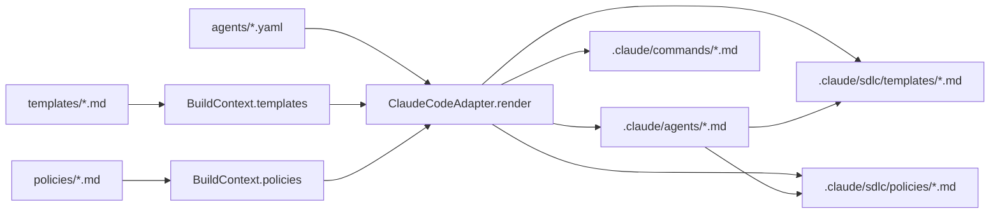

# High-Level Design: Self-Contained Claude Outputs

**Generated by:** solution-architect agent dogfood
**Date:** 2026-06-16
**Source PRD:** `docs/work/2026-06-16/self-contained-claude-outputs/01-prd.md`

---

## Architectural Drivers

- **Pilot usability (FR-001, FR-002, SC-002):** Claude output should be useful when `.claude/` is copied alone.
- **Determinism (FR-005, SC-004):** support files must be produced by the adapter as ordinary `OutputFile[]` entries so the existing build manifest tracks them.
- **Scope control (FR-008):** avoid broad engine or installer work before dogfood proves the need.
- **Source of truth preservation (FR-007):** root `templates/` and `policies/` remain canonical; generated support files must be visibly machine-owned.

## Design Options Considered

| Criterion | Option A: Copy support files under `.claude/sdlc/` | Option B: Inline policy/template bodies into every agent |
|-----------|-----------------------------------------------------|----------------------------------------------------------|
| Complexity | Low: add support outputs to Claude adapter | Medium: agent files become large and repetitive |
| Pilot usability | High: `.claude/` can be copied as a bundle | High: agents are standalone |
| Context efficiency | Better: agents keep concise references | Worse: repeated policy/template text increases context |
| Determinism | Strong: output files are deterministic | Strong, but snapshots become noisy |
| Team familiarity | Matches existing generated file approach | Less consistent with current reference-based outputs |
| Cost | Small adapter change | Larger generated output, more review churn |
| Reversibility | Easy to remove or alter support paths later | Harder once large inline prompts are relied on |

## ADR-001: Generate Claude support bundle under `.claude/sdlc/`

**Status:** Proposed

**Context:** Generated Claude agents currently reference canonical root-level `templates/` and `policies/`. That works inside this repo but is fragile for pilot installation. We need a narrow change that improves pilot usability without building the full installer.

**Decision:** The Claude Code adapter should render generated copies of referenced templates and policies into `.claude/sdlc/templates/` and `.claude/sdlc/policies/`. Generated agent files should point to these `.claude/sdlc/...` paths.

**Consequences:**
- Positive: `.claude/` becomes a coherent pilot bundle; support files are manifest-tracked without changing the build engine.
- Negative: duplicated content exists in generated output; users may still edit generated copies unless the footer is clear.
- Follow-ups: revisit this once `SKILL.md` adapter or installer UX exists; the support bundle may become a reusable packaging primitive.

## Delta (brownfield only)

| Component/behaviour | Change | Notes |
|--------------------|--------|-------|
| `packages/adapters/claude-code/src/index.ts` | MODIFIED | Render support files and update references in generated agents. |
| `packages/adapters/claude-code/src/__tests__/` | MODIFIED | Add path/content/snapshot coverage for support files. |
| `.claude/sdlc/templates/*.md` | ADDED | Generated copies of referenced templates. |
| `.claude/sdlc/policies/*.md` | ADDED | Generated copies of referenced policies. |
| `packages/cli/src/commands/build.ts` | UNCHANGED | Existing manifest path tracks all adapter outputs automatically. |

## Component Diagram

## Open Questions

- Should support files include the original canonical source path in a small header? Recommended: yes.
- Should support files be generated only when referenced, or copy all templates/policies? Recommended: only referenced files to avoid bloat.

---

## Handoff -> planner

**Next agent:** planner
**Inputs to provide:** this HLD and the PRD
**Binding decisions:** ADR-001
**Blocking items:** none
